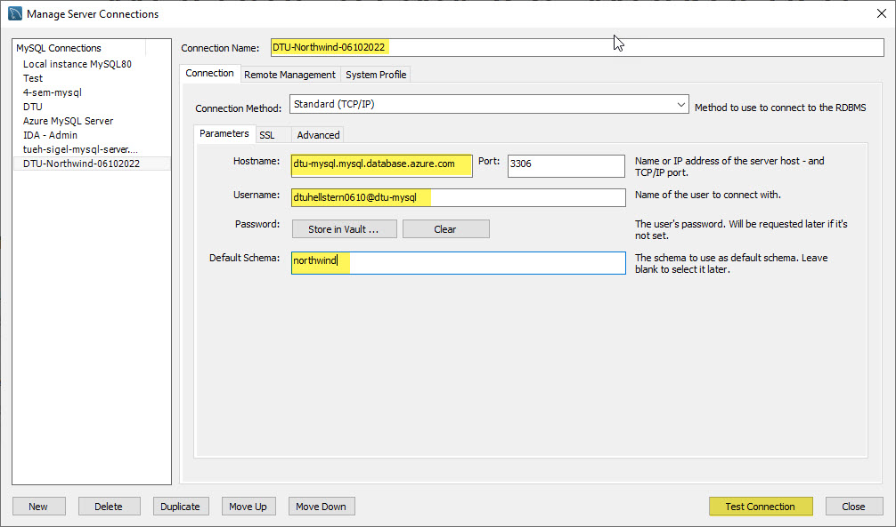
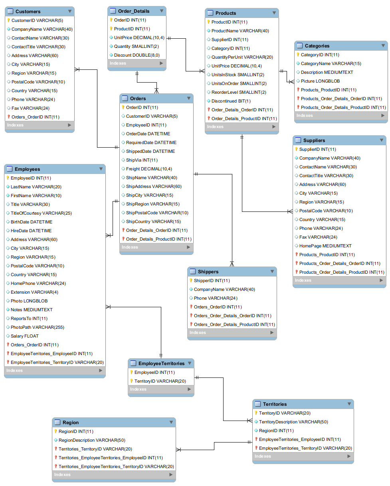

<span class="fs-1">
[HOME](../README.md){: .btn .btn-blue }
</span>

# Indhold - Online 06-10-2022

- [Database program](#database-program)
- [Northwind](#northwind)
- [Normalisering](#normalisering)
- [Relationer](#relationer)
- [SQL Introduktion](#sql---introduktion)
- [JOIN](#join)
- [VIEW](#view)

Denne dag har fokus på databaser, specifik er det MySQL som du kommer til at bruge.

<div style="position: relative; padding-bottom: 56.25%; height: 0;"><iframe src="https://www.loom.com/embed/f99f167ce634498a8176829a6d326643" frameborder="0" webkitallowfullscreen mozallowfullscreen allowfullscreen style="position: absolute; top: 0; left: 0; width: 100%; height: 100%;"></iframe></div>

De data du kommer til at arbejde med vil i mange tilfælde ligge i en Database.

Du kan enten tilgå dem direkte eller ved at data er eksporteret ud af databasen, f.eks. som en eller flere CSV filer.

For at arbejde effektiv med data er det nødvendigt at forstå hvordan en database er opbygget - Hvordan de forskellige tabeller "hænger" sammen og hvordan man kan kombinere data fra flere forskellige tabeller. Det er desuden en fordel at have viden om database programmerings sproget SQL.

# Database program
Det er databasen MySQL vi skal bruge og programmet MySQL Workbench.

[Download MySQL Workbench](https://dev.mysql.com/downloads/workbench/)

## Azure
I kommer til at arbejde med en MySQL database der er hostede på Azure i deres cloud løsning.

Fordelen ved det er at i ikke skal skal oprette databasen, tabeller og indsætte data. Det afspejler også godt de opgaver i kommer til at udfører senere, det vil være det færreste af jer der skal oprette en data base fra grunden.

### Login MySQL
I Workbench skal i oprette forbindelse til Azure databasen **Northwind**, med disse indstillinger:

- Server name: **dtu-mysql.mysql.database.azure.com**
- Login name: **dtuhellstern0610@dtu-mysql**
- Password: *udleveres i undervisningen* - Password er kun gyldigt i en kort periode!



<div style="position: relative; padding-bottom: 56.25%; height: 0;"><iframe src="https://www.loom.com/embed/27082293843041e7b0e20c4662304bae" frameborder="0" webkitallowfullscreen mozallowfullscreen allowfullscreen style="position: absolute; top: 0; left: 0; width: 100%; height: 100%;"></iframe></div>

# Northwind
*The Northwind database is a sample database used by Microsoft to demonstrate the features of some of its products, including SQL Server and Microsoft Access. The database contains the sales data for Northwind Traders, a fictitious specialty foods exportimport company.*

## Northwind ER-diagram
E/R-diagrammer (Entitets/Relations-diagram) er et værktøj til at modellere databaser. 
E/R diagrammer viser alle entiteter i en database samt relationerne imellem dem. Informationerne herfra benyttes, når databasen oprettes.

<div style="position: relative; padding-bottom: 56.25%; height: 0;"><iframe src="https://www.loom.com/embed/0b6ef0f5e2494f36ae17ebcdea89fceb" frameborder="0" webkitallowfullscreen mozallowfullscreen allowfullscreen style="position: absolute; top: 0; left: 0; width: 100%; height: 100%;"></iframe></div>




# Normalisering
Formået med normalisering er at undgå redundans og gøre databasen lettere at vedligeholde.

*Redundans er er gentagelser - Når en information står flere gange*

Der findes 6 normalformer og en "stramning" af den tredje ved navn Boyce-Cood normalformen.

Typisk fortager man kun en normalisering op til den tredje normalform.

<div style="position: relative; padding-bottom: 56.25%; height: 0;"><iframe src="https://www.loom.com/embed/b0909d14286d4b46ae44ac52b3415d0a" frameborder="0" webkitallowfullscreen mozallowfullscreen allowfullscreen style="position: absolute; top: 0; left: 0; width: 100%; height: 100%;"></iframe></div>


**1. Normalform (NF1)**

**Definition:** *En relation er på første normalform, hvis ingen af dens domæner har elementer, der i sig selv er mængder.*

* Tabellen har et nøglefelt (*behøver ikke at være unikt*)
* Der må kun være en værdi af samme type i hver post
* Alle poster skal være lige lange dvs. have samme antal felter

**2. Normalform (NF2)**

**Definition:** *En relation er på anden normalform, hvis den er på første normalform, og hvis enhver ikke-nøgle-attribut er fuldt funktionelt afhængig af enhver kandidatnøgle i relationen.*

- Tabellen skal opfylder 1. Normalform
- Der skal være en primærnøgle

**3. normalform (NF3)**

**Definition:** *En relation er på tredje normalform, hvis den er på anden normalform og det gælder, at ingen ikke-nøgle-attribut er transitivt afhængig af nogen kandidatnøgle i relationen.*

- Tabellen skal opfylder 2. Normalform
- Hvis der er mere end et felt der kan sættes som nøgle for andre felter skal tabellen opdeles i flere

### Eksempel - Skole
Udgangspunktet er et regneark der bruges til at register elever og deres karakter.

**NF 0**


*Hvad er problemet?*

**NF 1**


**NF 2**


**NF 3**


**ER-Diagram**

Over Skole i normalform 3. Med angivelse af datatyper og relationer melle de 5 tabeller.


Du kan bruge Workbench til at tegne dit ER-diagram. Jeg vil dog altid anbefale at du starter med tegne ER-Diagrammet på et stykke papir.

# Relationer
MySQL er en relationel database, hvilket betyder at data er opdelt i tabeller som det er muligt at oprette relationer i mellem.

Hver tabel har en primærnøgle, som består af et eller flere felter i tabellen. Primærnøglen skaber en unik identifikation af den enkelte række i tabellen. 

En fremmednøgle er et felt i en tabel, som peger på en primærnøgle i en anden tabel og dermed skaber relation mellem de to tabeller. 

Der findes tre typer af relationer:

- En til Mange
- En til En
- Mange til Mange

<div style="position: relative; padding-bottom: 56.25%; height: 0;"><iframe src="https://www.loom.com/embed/a168f31f3a8d48e5a76bc6f954a9108f" frameborder="0" webkitallowfullscreen mozallowfullscreen allowfullscreen style="position: absolute; top: 0; left: 0; width: 100%; height: 100%;"></iframe></div>


**En til Mange**

Det er denne relations type der typisk er flest af i en database. 

I Northwind databasen har vi en typisk **En til Mange** relation mellem tabellerne **Customers** og **Orders**.

Hver kunde står kun en gang i **Customeres** tabellen, men da hver kunde har en eller flere ordre står kunden flere gange i tabellen **Orders**.

Det vil sige at relationen går fra primær nøglen **CustomerID** (*En siden*) i tabellen **Customeres** til fremmednøglen i, CustomerID i tabellen **Orderes** (*Mange siden*).


**En til En**

Denne relations type bruges kun brugt af to grunde:

- Sikkerhed
- Opdeling af en meget stor tabel

Årsagen er at man ligeså godt kunne have alle data i en tabel.

**Eksempel**


Et eksempel kunne være fortrolige oplysninger som:

- Cpr nummer
- Løn
- Pension

Der er gemt i en selvstændig tabel som så er relateret til en tabel med det mere "almindelige" oplysninger som navn, mobilnummer, e-mail osv.

**Mange til Mange**

Det er **ikke** muligt at oprette en Mange til Mange relation i MySQL databasen.

En Mange til Mange relation skal løses ved at indskyde en ekstra tabel og så oprette to stk. En til Mange relationer.

I Northwind databasen er der mange ordre og der er mange produkter - hver ordre består af et eller flere produkter.

Der er altså en **Mange til Mange** relation mellem tabellerne **Orders** og **Products**.

Dette løses var at oprette en ekstra tabel - Order_details - Da denne relationen melle de to tabeller **ikke** kan oprettes direkte.


# SQL - Introduktion

<div style="position: relative; padding-bottom: 56.25%; height: 0;"><iframe src="https://www.loom.com/embed/8c6205cc3fd14e21b8e3b297d5210fb4" frameborder="0" webkitallowfullscreen mozallowfullscreen allowfullscreen style="position: absolute; top: 0; left: 0; width: 100%; height: 100%;"></iframe></div>

## Opgaver
Jeg har lavet 10 opgaver som jeg vil have dig til at løse - Det selv at skrive SQL koden er klart den bedste måde at lære det på - **Så prøv dig frem :-)**

Du finder opgaverne her: [SQL Opgaver](./sql-opgaver.md)

Hvis du kører fast har du her en SQL der indeholder løsningen til de 10 opgaver - [sql-opgaver.sql](./filer/sql-opgaver.sql)

Denne fil kan du åbne i MySQL Workbench og afvikle SQL koden.

**Prøv selv at løse opgaverne før du ser på min løsning**

## SELECT
**SELECT** er nok den mest brugte SQL kommando.
Den bruges til at hente data ud af din database.

**Syntax SELECT**

```sql
SELECT kolonne_1, kolonne_2,  ...
FROM tabel_navn;
    
SELECT * FROM tabel_navn
```

**Northwind Syntax SELECT**

```sql
select * from Employees;

select
    EmployeeID,
    FirstName,
    LastName
from Employees;
```

## Kommentarer

Det kan være en rigtig god ide at skrive kommentarer til dine SQL koder.
Der er to forskellige muligheder for  kommentarer

- På en enkelt linje - her brugere du: --
- Over flere linjer - her brugere du: /* kommentar */

**Eksempler på en kommentar på en linje**

```sql
--Select all
SELECT * FROM Customers;

SELECT * FROM Customers -- WHERE City='Berlin';
```

Hvis du gerne vil skrive en kommentar der fylder mere end en linje eller det er flere linjer kode du gerne vil ud-kommenter skal du bruge denne metode:

```sql
/* 
Vælg alle kolonner
og alle poster 
i Customers tabellen 
*/

SELECT * FROM Customers;
```

Alt imellem /* og */ bliver ignoreret.
 

## DISTINCT
Bruges sammen med **SELECT** til at returnere unikke værdier. Altså kun en af hver værdi.

**Syntax DISTINCT**

```sql
    SELECT DISTINCT kolonne_1, kolonne_2,  ...
    FROM tabel_navn;
```

**Northwind Syntax DISTINCT**

```sql
    select distinct Country from Customers;
```
## WHERE
Bruges sammen med **SELECT** for at udvælge data.   
Det er kun de data der opfylder dit krav (**WHERE**) der vises.

**Syntax WHERE**

```sql
    SELECT kolonne_1, kolonne_2,  ...
    FROM tabel_navn
    WHERE betingelse;
```

**Northwind Syntax WHERE**

```sql
    select * from Customers
    where Country = 'Denmark';
```

**WHERE** kan også bruges sammen med andre SQL kommandoer end **SELECT**. F.eks. **UPDATE** og **DELETE**

## AND, OR, NOT
Du kan kombinere WHERE med AND, OR og NOT.

AND og OR bruger du til at udvælge data på mere end én betingelse.

* AND viser data der opfylder **alle** betingelser
* OR viser data hvor det bare er **en** af betingelserne der er opfyldt

NOT bruges til at vise data der ikke opfylder betingelsen.

**Syntax AND**

```sql
    SELECT kolonne_1, kolonne_2,  ...
    FROM tabel_navn
    WHERE betingelse_1 AND betingelse_2 AND betingelse_3 ...;
```


**Northwind Syntax AND**

```sql
    SELECT kolonne_1, kolonne_2,  ...
    FROM tabel_navn
    WHERE betingelse_1 AND betingelse_2 AND betingelse_3 ...;
```

**Syntax OR**

```sql
    SELECT kolonne_1, kolonne_2,  ...
    FROM tabel_navn
    WHERE betingelse_1 OR betingelse_2 OR betingelse_3 ...;
```

**Northwind Syntax OR**

```sql
    select * from Customers
    where Country = 'Denmark'
    or Country = 'Sweden';
```

**Syntax NOT**

```sql
    SELECT kolonne_1, kolonne_2,  ...
    FROM tabel_navn
    WHERE NOT betingelse;
```

**Northwind Syntax NOT**

```sql
    select * from Customers
    where not Country = 'USA';
```


## BETWEEN
BETWEEN bruges til at udvælge et "interval".   
Det kan være tal, tekst eller datoer.

**Syntax BETWEEN**

```sql
    SELECT kolonne_1, kolonne_2,  ...
    FROM tabel_navn
    WHERE kolonne_1 BETWEEN værdi_1 AND værdi_2;
```

**BETWEEN** har altid dine start og slut værdier med.

## IN
**IN** giver dig mulighed for at bruge flere værdier i en WHERE sætning.

**Syntax IN**

```sql
    SELECT kolonne_1, kolonne_2,  ...
    FROM tabel_navn
    WHERE kolonne_1 IN (værdi_1, værdi_2, ...);
    
    SELECT kolonne_1, kolonne_2,  ...
    FROM tabel_navn
    WHERE kolonne_1 IN (SELECT sætning);
```    

## ORDER BY
Hvis du vil sortere dine data skal du bruge **ORDER BY**.  

**ORDER BY** sorterer i stigende orden som standard - **ASC**.  
For at sortere i faldende orden skal du bruge **DESC**.

**Syntax ORDER BY**

```sql
    SELECT kolonne_1, kolonne_2,  ...
    FROM tabel_navn
    ORDER BY ASC
    
    SELECT kolonne_1, kolonne_2,  ...
    FROM tabel_navn
    ORDER BY DESC
```

**Syntax ORDER BY Northwind**

```sql
    select * from Order_Details
    order by UnitPrice ASC;

    select * from Order_Details
    order by UnitPrice DESC;
```

## Funktioner

MySQL har mange funktioner som du kan bruge, nogle eksempler er:

- DAY()
- MONTH()
- YEAR()

**Eksempel fra Northwind**

```sql
SELECT 
    OrderID,
    OrderDate,
    DAY(OrderDate) as Dag,
    MONTH(OrderDate) as Måned,
    YEAR(OrderDate) as År
FROM Orders;
```

Du kan finde en oversigt her [Link](https://dev.mysql.com/doc/refman/8.0/en/func-op-summary-ref.html)

## Beregninger

Du har også mulighed for at fortage beregninger på dine data, det kan være simple beregninger som det at gange to kolonner med hinanden eller det kan være beregninger hvor du brugere nogle funktioner.

**SQL Beregninger**

- Plus: +
- Minus: -
- Gange: *
- Division: /
- Modulus: %

**Eksempel fra Northwind**

```sql
SELECT
    OrderID,
    ProductID,
    UnitPrice,
    Quantity,
    Discount,
    UnitPrice * Quantity as Pris_Uden_Rabat
FROM Order_Details;
```

### Brug af Funktioner

Du kan bruge forskellige beregnings funktioner på dine data.

```sql
-- AVG
SELECT AVG(UnitPrice)
FROM Products;

-- MIN
SELECT MIN(UnitPrice)
FROM Products;

-- MAX
SELECT MAX(UnitPrice)
FROM Products;

-- COUNT 
SELECT COUNT(ProductID)
FROM Products;

-- SUM
SELECT
    SUM((UnitPrice * Quantity) - (UnitPrice * Quantity * Discount)) AS Sale
FROM Order_Details;
```


## GROUP BY
GROUP BY-sætningen bruges ofte sammen med en beregnings funktioner som f.eks. AVG, MIN, MAX, COUNT og SUM til at gruppere dit resultat.

Det kan f.eks. være det totale salg på en kunde eller et produkt.

```sql
SELECT
    Order_Details.OrderID,
    COUNT(Order_Details.Quantity) AS Antal,
    SUM((UnitPrice * Quantity) - (UnitPrice * Quantity * Discount)) AS Sale
FROM Order_Details
GROUP BY Order_Details.OrderID;

SELECT
    Employees.LastName,                            
    COUNT(Orders.OrderID) AS NumberOfOrders
FROM Orders INNER JOIN Employees
ON Orders.EmployeeID = Employees.EmployeeID
GROUP BY LastName:
```

### HAVING
Hvis du vil "udvælge" data på basis af en gruppering (GROUP BY) kan du IKKE bruge WHERE.

Dette eksempel fra Northwind vil **ikke** virke, da der bruges **WHERE**.

```sql
SELECT 
    Country,
    COUNT(CustomerID)
FROM Customers
GROUP BY Country
WHERE COUNT(CustomerID) > 5;
```

Når der er fortaget en gruppering på *"CustomerID"* skal du bruge SQL kommandoen **HAVING** for at det virker.

Samme eksempel fra Northwind, men med **HAVING**

```sql
SELECT 
    Country,
    COUNT(CustomerID)
FROM Customers
GROUP BY Country
HAVING COUNT(CustomerID) > 5;
```

Det er muligt at bruge **WHERE** sammen med **GROUP BY** det skal bare være så du udvælger på data der ikke er grupperet på.

**Eksampel fra Northwind**

```sql
SELECT 
    Country,
    COUNT(CustomerID)
FROM Customers
WHERE Country IN ('UK', 'USA', 'Italy')
GROUP BY Country
HAVING COUNT(CustomerID) > 5;
```

## INDEX
Du kender et index fra en bog, hvor der typisk er et index bageret i bogen. Det gør det nemmere og hurtigere at finde et bestemt ord/emne.

Det sammen gælder indexer i SQL, de gør det hurtigere at finde data.

Som standard oprettes der et index når du opretter en primær nøgle. Dette index er et unikt index - *det er jo en primær nøgle.*

Du opretter et index med SQL kommandoen **CREATE INDEX**

```sql
CREATE INDEX index_navn
ON tabel_navn (felt_navn);

CREATE INDEX FK_CustomerID
ON Orders (CustomerID);
```

Brugeren kan ikke se de indexer der er oprette, men du kan se dem under den enkelte tabel i mappen **Indexes**


Det er også muligt at oprette et index hvor du kombinere flere kolonner.

**Eksempel fra Northwind**

```sql
CREATE INDEX Emp_name
ON Employees (LastName, FirstName);
```

### UNIQUE INDEX
Det er muligt at oprette et unikt index, ligesom det index der oprettes ved primær nøglen. Det kan f.eks. bruges til at sikre at en kunde ikke oprettes to gange - kunne f.eks. være kundes CVR nummer.

```sql
CREATE UNIQUE INDEX index_navn
ON tabel_navn (felt_navn);

CREATE UNIQUE INDEX UniqProduct
ON Products (ProductName);
```

### DROP INDEX
Du kan fjerne et index med kommandoen **DROP INDEX** kombineret med **ALTER TABLE**

```sql
ALTER TABLE tabel_navn
DROP INDEX index_navn;

ALTER TABLE Employees
DROP INDEX Emp_name;
```

### Hvilke felter
*Hvilke felter skal du så oprette indekser på?*

Som udgangspunkt bliver der oprettet et unikt index på dine primærnøgle. Ud over det vil det typisk være en fordel at oprette indekser på de felter der er **fremmede nøgler**.

Dernæst kan du med fordel oprette indekser på de felter hvor der søges meget. Det kan være svært at vide hvilke felter det er, en mulighed er at spørgere brugerne eller bruge et analyse værktøj til at finde disse felter.

Der er dog en ulempe ved oprettelsen af indekser - Det at gemme data bliver **langsommere**. årsagen er at indekserne skal opdateres med de nye data.

Hvis man skal indsætte eller opdatere store mængder data kan det være en fordel at slette dine indekser først og så oprette dem igen, når indsættelsen af data er færdig.


## CASE
En CASE sætning opsætter forskellige betingelser som data så "holdes" op imod og der returneres en værdi i forhold til det.

En CASE sætning virker som en IF-THEN-ELSE sætning.

Når en værdi er SAND, falder indenfor en CASE, så returneres resultatet.

Hvis ingen betingelser er sande, returnerer den værdien i ELSE-klausulen.

```sql
CASE
    WHEN betingelse_1 THEN resultat_1
    WHEN betingelse_2 THEN resultat_2
    WHEN betingelse_n THEN resultat_n
    ELSE resultat
END;
```

**Eksempel fra Northwind**

```sql
SELECT 
    OrderID, 
    Quantity,
CASE
    WHEN Quantity > 30 THEN 'Antal er større end 30'
    WHEN Quantity = 30 THEN 'Antal er 30'
    ELSE 'Antal er under 30'
END AS 'Antal ordre'
FROM Order_Details;
```

# JOIN
Du skal bruge SQL kommandoen **JOIN** for hente data fra flere tabeller.

Der findes 4 forskellige **JOIN** typer:

- INNER JOIN  
- LEFT JOIN  
- RIGHT JOIN
- FULL JOIN (*ikke understøttet i MySQL*)
- SELF JOIN

<div style="position: relative; padding-bottom: 56.25%; height: 0;"><iframe src="https://www.loom.com/embed/2d11577cf2c5498397837dbf59db7d5d" frameborder="0" webkitallowfullscreen mozallowfullscreen allowfullscreen style="position: absolute; top: 0; left: 0; width: 100%; height: 100%;"></iframe></div>

## Opgaver
Jeg har lavet 5 opgaver som jeg vil have dig til at løse - Det selv at skrive SQL koden er klart den bedste måde at lære det på - **Så prøv dig frem :-)**

Du finder opgaverne her: [JOIN Opgaver](./join-opgaver.md)

Hvis du kører fast har du her en SQL der indeholder løsningen til de 5 opgaver - [join-opgave.sql](./filer/join-opgave.sql)

Denne fil kan du åbne i MySQL Workbench og afvikle SQL koden.

**Prøv selv at løse opgaverne før du ser på min løsning**


## INNER JOIN
Henter fællesmængden fra de to tabeller - Altså der hvor værdierne er ens.


### Eksempel 1
```sql
select
	orders.OrderID,
    orders.CustomerID,
    customers.CompanyName
from orders inner join customers
on orders.CustomerID = customers.CustomerID;
```

### Eksempel 2
```sql
select 
	products.ProductID,
    products.CategoryID,
    categories.CategoryName
from products inner join categories
on products.CategoryID = categories.CategoryID;
```

## LEFT JOIN
Henter alle data fra den venstre tabel (*table1*) og de data der matcher fra den anden tabel (*tabel2*).


Kaldes også **LEFT OUTER JOIN**

### Eksempel
Her er et eksempel fra Northwind der viser to kunder der ikke har købt noget. Hvis du brugere INNER JOIN vil det to kunder IKKE komme med. Jeg har IS NULL for kun at vise dem.

```sql
select 
	customers.CustomerID,
    customers.CompanyName,
    OrderID
from customers left join orders
on customers.CustomerID = orders.CustomerID
where OrderID is null;
```

## RIGHT JOIN
Henter alle data fra den højre tabel (*table2*) og de data der matcher fra den anden tabel (*tabel1*).


Kaldes også **RIGHT OUTER JOIN**


## FULL JOIN
Der findes også en **FULL JOIN**, der henter alle data fra begge tabeller.

**Bemærk** at MySQL **IKKE** understøtter **FULL JOIN**


## SELF JOIN
En **SELF JOIN** joiner en tabel med sig selv.
Tabellen **Employees** i Northwind databasen har et eksempel på dette.

Der er ef felt **ReportsTo** der referer til primærnøglen **EmployeeID** i sammen tabel.

```sql
select
	Chef_Tbl.LastName as Chef,
    Ansat_Tbl.LastName as 'Chef for'
from employees as Ansat_Tbl
inner join employees as Chef_Tbl
on Ansat_Tbl.ReportsTo = Chef_Tbl.ReportsTo
order by Chef;
```

# VIEW
Et **VIEW** kan betragtes som en virtuel tabel. 
Et **VIEW** har kolonner og poster som en tabel, men den bliver oprettet via en SQL sætning på basis af en eller flere andre tabeller.

<div style="position: relative; padding-bottom: 56.25%; height: 0;"><iframe src="https://www.loom.com/embed/203c0a51047a4326905b03c3ef25bca4" frameborder="0" webkitallowfullscreen mozallowfullscreen allowfullscreen style="position: absolute; top: 0; left: 0; width: 100%; height: 100%;"></iframe></div>

Et **VIEW** kan erstatte en kompliceret SQL sætning.
Det er altså nemmere for brugeren at hente data fra et **VIEW**.

Et **VIEW** vil altid vises de nyeste data.

```sql
    CREATE VIEW view_navn AS
    SELECT kolonne_1, kolonne_2,
    FROM tabel
    WHERE betingelse;
```

**Eksempel fra Northwind**
```sql
    create view Salg_Pr_Kunde AS
    select 
        Customers.CustomerID,
        Customers.CompanyName,
        sum(Order_Details.UnitPrice * Order_Details.Quantity) as Salg
    from Customers
    join Orders
        on Customers.CustomerID = Orders.CustomerID
    join Order_Details
        on Orders.OrderID = Order_Details.OrderID
    group by Customers.CustomerID, Customers.CompanyName;
```

Du finder **VIEW** i en selvstændig mappe