
[HOME](../README.md){: .btn .btn-blue }

# IKKE HELT KLAR ENDNU!!!

# Indhold - Online 13-10-2022

- [SQL Repetition](#sql-repetition)
- [Database og Pivottabel](#database-og-pivottabel)

# SQL Repetition
For lige at opfriske din SQL viden er der 5 SQL opgaver som jeg vil anbefale dig at løse.

[SQL Repetition opgaver](./sql-repetion.md)

# Database og Pivottabel
Denne del har fokus på Pivottabeller og database. Du kan med fordel se på [dtu.officegeek.dk/excel/pivottabel.html](https://dtu.officegeek.dk/excel/pivottabel.html) for mere information omkring Pivottabeller.

Hvis det er muligt er den fordel at forbinde en Pivottabel direkte til den database hvor data er gemt.

## MySQL Driver
Alt efter hvilken database du skal forbinde til skal du bruge en driver. I vores tilfælde er det MySQL vi skal forbinde til og derfor skal der installeres en driver der gør dette muligt.

Denne driver henter du her:

[dev.mysql.com/downloads/connector/odbc](https://dev.mysql.com/downloads/connector/odbc/)

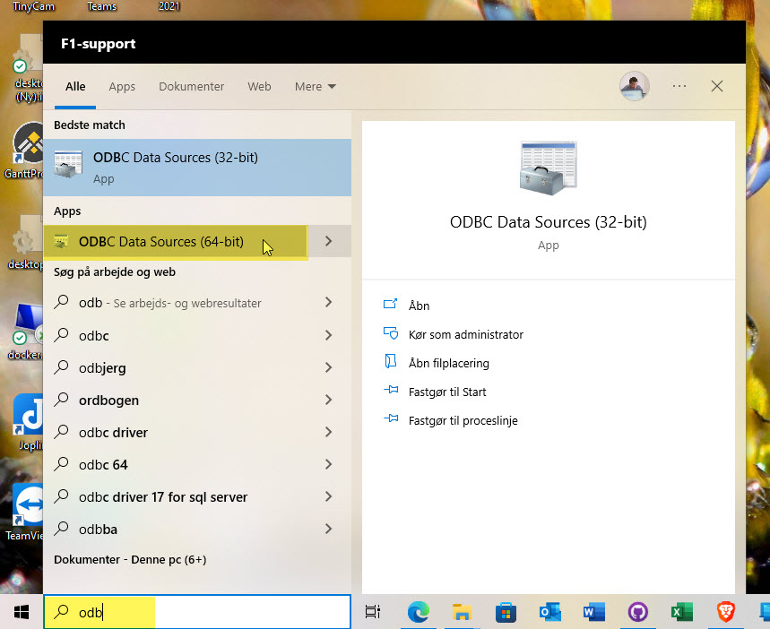

Vælg det operativ system du brugere. Hvis du brugere Windows er der stor sandsynlighed for at det er en **64-bit** version.

**Note**: *Det er muligt at hente driveren uden en Oracle konto*

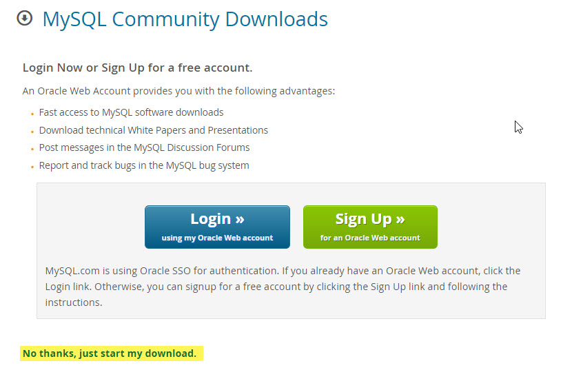

Du installere driveren som et program.

### Video

<iframe src="https://www.loom.com/embed/5431e31200f3463e9ec1c382e5614cea" frameborder="0" webkitallowfullscreen mozallowfullscreen allowfullscreen style="position: absolute; top: 0; left: 0; width: 100%; height: 100%;"></iframe>

## Forbind til database
Når du har hente MySQL Driveren er det muligt at forbinde til vores MySQL database direkte fra Excel.

### Database oplysninger
Bemærk at det er en ny database, jeg blev tvunget til at opgradere, for at kunne oprette adgang fra Excel - Så nye oplysninger:

- Server name: **dtudatabase.mysql.database.azure.com**
- Login name: **dtuhellstern**
- Password: *Kommer på e-mail* - Password er kun gyldigt i en kort periode!

### Opret forbindelse
Du skaber forbindelse til MySQL serveren på følgende måde:

- Vælg **Data** fanen
- Klik på **Get Data** > **From Database** > **From MySQL Database**

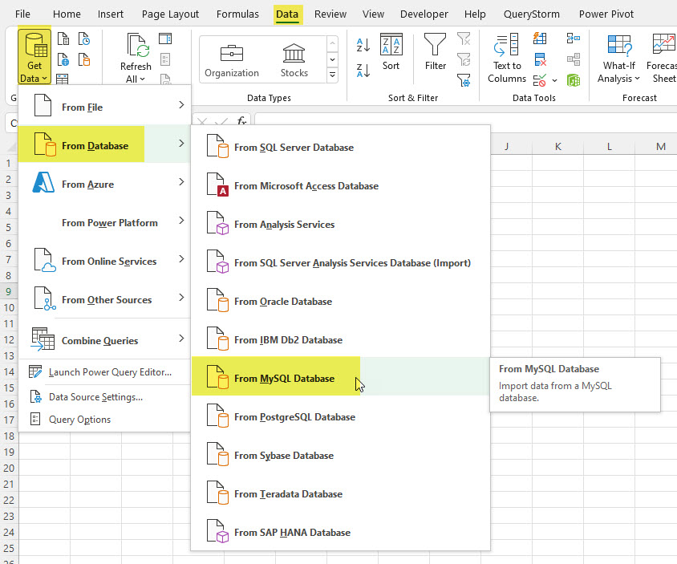

- Indtast:
    - Server: **dtudatabase.mysql.database.azure.com**
    - Database **northwind**

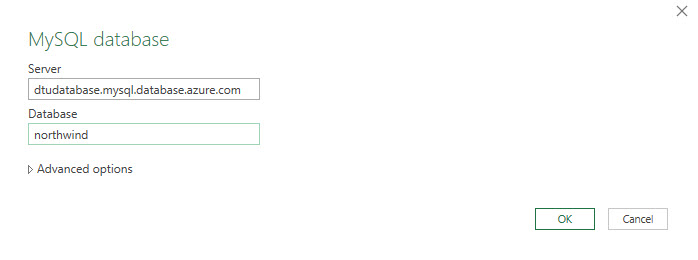

- Vælg Database og indtast
    - User name: **dtuhellstern**
    - Password: *udleveret*
    - Select level: **dtudatabase.mysql.database.azure.com;northwind**

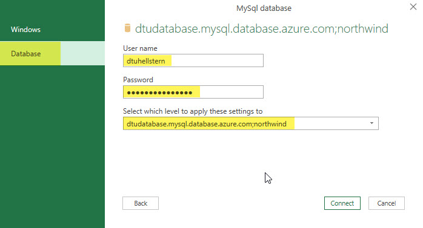

- Du har nu adgang til alle tabeller i databasen
- Marker **alle tabeller**, så du får adgang til al data
- Vælg **Load** > **Load To**

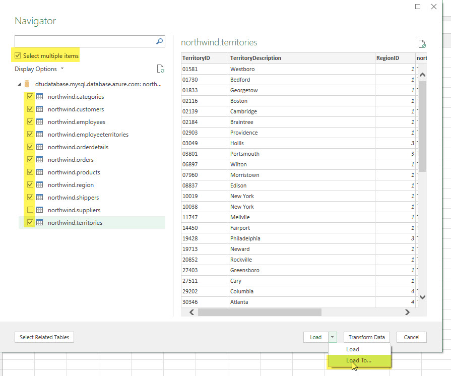

- Import Data
    - Vælg **Only Create Connection**
    - Sæt hak i **Add this to the Data Model**

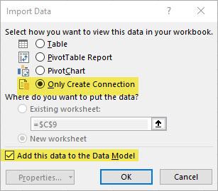

Nu har du fået adgang til alle tabeller/data fra MySQL serveren.

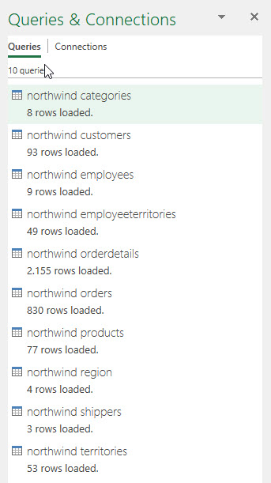

### Video

<iframe src="https://www.loom.com/embed/a5eb316cb03a4df48c468b32bbf8c839" frameborder="0" webkitallowfullscreen mozallowfullscreen allowfullscreen style="position: absolute; top: 0; left: 0; width: 100%; height: 100%;"></iframe>

## Relationer
Vi skal nu have oprette relationer imellem de forskellige tabeller. Den nemmeste måde er at bruge **Manage Data Model** "*programmet*".

Det finder du under Data fanen - *For Windows*

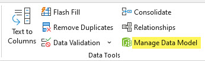

De relationer du skal oprette kan du ser her

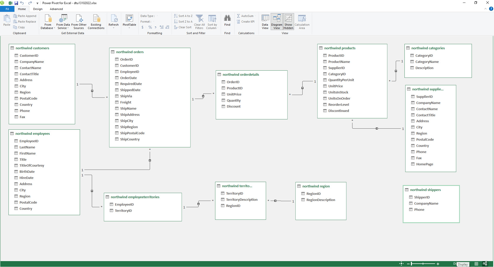

### Video

<iframe src="https://www.loom.com/embed/905589301a9e493a8ac939626fd49690" frameborder="0" webkitallowfullscreen mozallowfullscreen allowfullscreen style="position: absolute; top: 0; left: 0; width: 100%; height: 100%;"></iframe>

## Ekstra felter
Du vil få behov for nogle ekstra felter:

- Total = UnitPrice * Quantity
- År ud fra OrderDate

Disse felter oprettes i **Manage Data Model**

## Pivottabeler
Du skal nu oprette Pivottabeller, hvilket gøres på følgende måde:

- Vælg fanen Insert
- Vælg PivotTable
- Vælg From Data Model

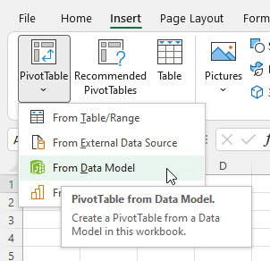

Du har nu adgang til alle tabeller og kan bruge data på tværs af disse, da der jo er relationer imellem alle tabeller.

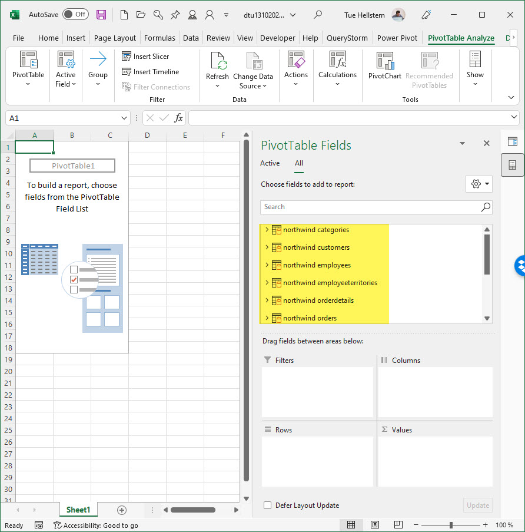

### Salg fordelt på Products
Den først Pivottabel du skal oprette skal vise salget fordelt på produkter

