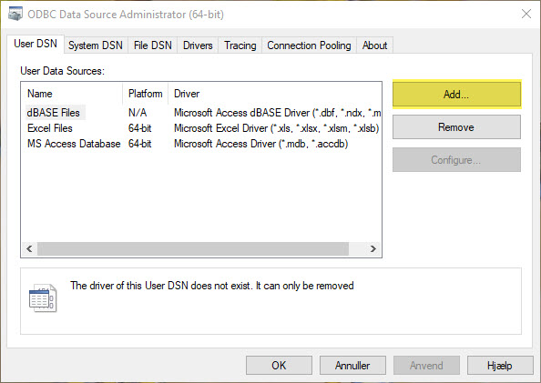
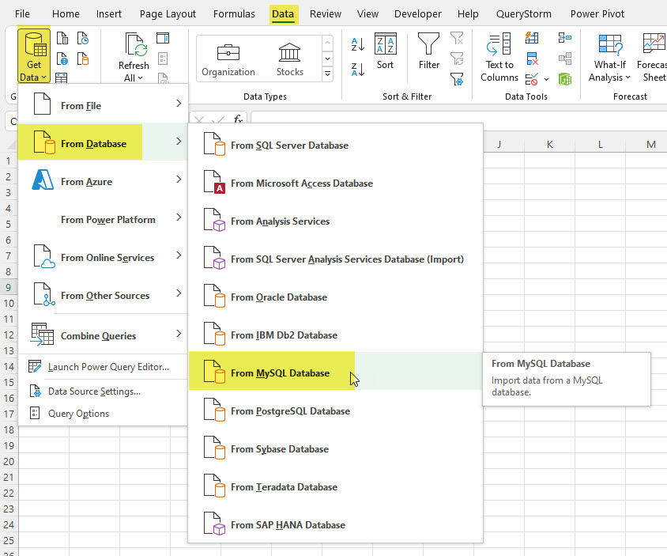
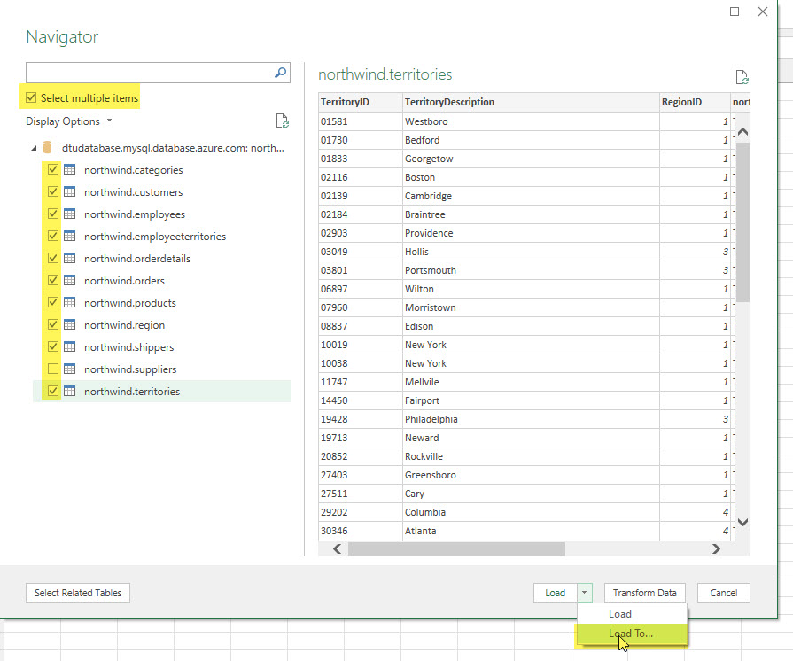
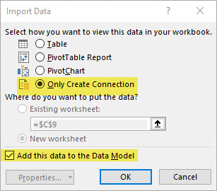
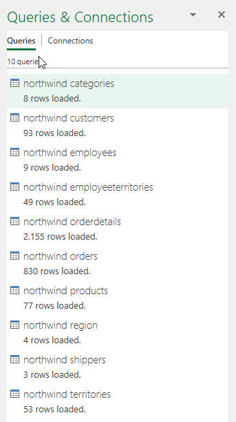
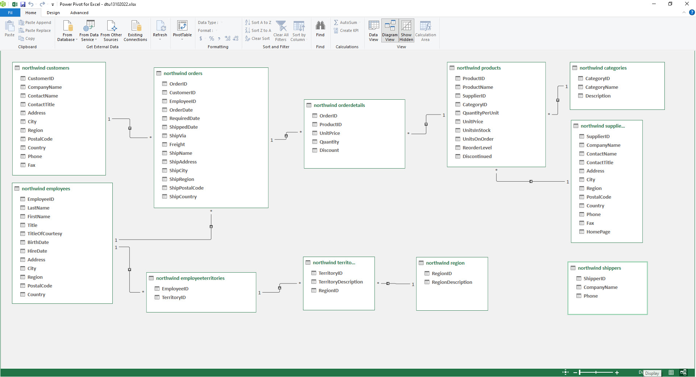
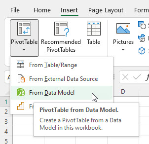

[HOME](../README.md){: .btn .btn-blue }

# Indhold - Online 16-03-2023
- [SQL Repetition](#sql-repetition)
- [Database og Pivottabel](#database-og-pivottabel)
- [Opret forbindelse til Mysql](#opret-forbindelse-til-mysql)
- [Relationer](#relationer)
- [Ekstra felter](#ekstra-felter)
- [Opret Pivottabeller Opgaver](#opret-pivottabeller-opgaver)

# SQL Repetition
For lige at opfriske din SQL viden er der 5 SQL opgaver som jeg vil anbefale dig at løse.

[SQL Repetition opgaver](./sql-repetion.md)

# Database og Pivottabel
Denne del har fokus på Pivottabeller og database. Du kan med fordel se på [dtu.officegeek.dk/excel/pivottabel.html](https://dtu.officegeek.dk/excel/pivottabel.html) for mere information omkring Pivottabeller.

Hvis det er muligt er den fordel at forbinde en Pivottabel direkte til den database hvor data er gemt, på den måde vil data altid være opdateret.

## MySQL Driver
Alt efter hvilken database du skal forbinde til skal du bruge en *driver*. I vores tilfælde er det MySQL vi skal forbinde til og derfor skal der installeres en driver der gør dette muligt.

Denne driver henter du her:

[dev.mysql.com/downloads/connector/odbc](https://dev.mysql.com/downloads/connector/odbc/)

Vælg det operativ system du brugere. Hvis du brugere Windows er der stor sandsynlighed for at det er en **64-bit** version.

**Note**: *Det er muligt at hente driveren uden en Oracle konto*

Du installere driveren som et program.

### Video

<iframe src="https://www.loom.com/embed/ccb0907a6fde4da48d9f5cd1ad37ad44" frameborder="0" webkitallowfullscreen mozallowfullscreen allowfullscreen style="position: absolute; top: 0; left: 0; width: 100%; height: 100%;"></iframe>

## Database
Når du har hente MySQL Driveren er det muligt at oprette en forbindelse til vores MySQL database direkte fra Excel.

### Database oplysninger
Bemærk at det er en ny database, jeg blev "*tvunget*" til at opgradere, for at kunne oprette adgang fra Excel - Så her er de nye oplysninger:

- Server name: **dtu2023northwind.mysql.database.azure.com**
- Login name: **hellstern**
- Password: *Kommer på e-mail* - Password er kun gyldigt i en kort periode!

# Opret forbindelse til Mysql
Der er to måder du kan oprette forbindelse til en MySQL server på fra Excel.

Hvilken du har mulighed for at bruge afhænger af din Excel version, driver version og styresystem.

## Under Get Data
Du kan skabe forbindelse til MySQL serveren på følgende måde:

- Vælg **Data** fanen
- Klik på **Get Data** > **From Database** > **From MySQL Database**

Note: Hvis du ikke har punktet **From MySQL Database** skal du bruge løsningen med DNS

- Indtast:
    - Server: **dtu2023northwind.mysql.database.azure.com**
    - Database **northwind**

- Vælg Database og indtast
    - User name: **hellstern**
    - Password: *udleveret*
    - Select level: **dtu2023northwind.mysql.database.azure.com;northwind**

- Du har nu adgang til alle tabeller i databasen
- Marker **alle tabeller**, så du får adgang til al data
- Vælg **Load** > **Load To**

- Import Data
    - Vælg **Only Create Connection**
    - Sæt hak i **Add this to the Data Model**

Nu har du fået adgang til alle tabeller/data fra MySQL serveren.

### Video

<iframe src="https://www.loom.com/embed/e578058ca63b4d8a838076cdbf714474" frameborder="0" webkitallowfullscreen mozallowfullscreen allowfullscreen style="position: absolute; top: 0; left: 0; width: 100%; height: 100%;"></iframe>

## Med ODBC/DNS
En anden måde er at oprette en **ODBC/DNS** forbindelse til MySQL Serveren.

- Søg efter ODBC Data Sources
- Vælg ODBC Data Source (64-bit)

- Klik på **Add**

- Vælg driveren med navnet **MySQL ODBC 8.0 Unicode Driver**
- Klik **Udfør**

- Indtast brugere/server/database oplysninger:
    - Data Source Name: *Det navn du ønsker at finde forbindelsen under*
    - TCP/IP server: **dtu2023northwind.mysql.database.azure.com**
    - User: **hellstern**
    - Password: *Sendt til dig*
    - Database: northwind

Du har nu oprette en ODBC forbindelse til MySQL Serveren som du kan bruge i Excel.

### Video

<iframe src="https://www.loom.com/embed/c7dedbd58bff4a158728632bfcb2dc8f" frameborder="0" webkitallowfullscreen mozallowfullscreen allowfullscreen style="position: absolute; top: 0; left: 0; width: 100%; height: 100%;"></iframe>

## Brug af ODBC/DNS fra Excel
Nu skal vi bruge den ODBC forbindelse vi lige har oprettet.

I Excel gør du følgende:

- Vælg **Data** fanen
- Vælg **Get Data** > **From Other Sources** > **From ODBC**

- Vælg den ODBC forbindelse du lige har oprette
    - **DTU MySQL Northwind** (*I mit tilfælde*)

- Sæt hak i **Select multiple items**
- Vælg databasen northwind
- Sæt hak ud for alle tabeller
- Vælg **Load To** under *Load*

- Vælg følgende i Import data vinduet:
    - **Only Create Connection**
    - **Add this data to the Data Model**
- Data er nu tilgængelige i Excel

### Video 

<iframe src="https://www.loom.com/embed/381e523c34cf417f85bfafacfa10a82a" frameborder="0" webkitallowfullscreen mozallowfullscreen allowfullscreen style="position: absolute; top: 0; left: 0; width: 100%; height: 100%;"></iframe>

# Relationer
Vi skal nu have oprette relationer imellem de forskellige tabeller. Den nemmeste måde er at bruge **Manage Data Model** "*programmet*".

Det finder du under Data fanen - *For Windows*

De relationer du skal oprette kan du ser her

### Video

<iframe src="https://www.loom.com/embed/1665cdb12b094727b8d219e4808c13a3" frameborder="0" webkitallowfullscreen mozallowfullscreen allowfullscreen style="position: absolute; top: 0; left: 0; width: 100%; height: 100%;"></iframe>

# Ekstra felter
Du vil få behov for nogle ekstra felter:

- Total beregnet: **=UnitPrice*Quantity**
- År ud fra OrderDate: **=Year(OrderDate)** 
- Måneds navn ud fra OrderData: **=FORMAT('northwind orders'[OrderDate];"MMM")**

Disse felter oprettes i **Manage Data Model**

### Video

<iframe src="https://www.loom.com/embed/9b0b20962a084741a4af177a63f4df08" frameborder="0" webkitallowfullscreen mozallowfullscreen allowfullscreen style="position: absolute; top: 0; left: 0; width: 100%; height: 100%;"></iframe>

## Pivottabeler
Du skal nu oprette Pivottabeller, hvilket gøres på følgende måde:

- Vælg fanen **Insert**
- Vælg **PivotTable**
- Vælg **From Data Model**

Du har nu adgang til alle tabeller og kan bruge data på tværs af disse, da der jo er relationer imellem alle tabeller.

### Top 5 Products
Den først Pivottabel du skal oprette skal vise de 5 produkter vi sælger mest af, set ud fra omsætning.

<iframe src="https://www.loom.com/embed/bc8b3e1bf944484b8936f15b7af524c6" frameborder="0" webkitallowfullscreen mozallowfullscreen allowfullscreen style="position: absolute; top: 0; left: 0; width: 100%; height: 100%;"></iframe>

# Opret Pivottabeller Opgaver
For at få lidt øvelse kan du oprette disse Pivottabeller

### Top 10 Customers

### Salg fordelt på lande (Country) i forhold til år
Bemærk 0 ud for Argentina :-)

