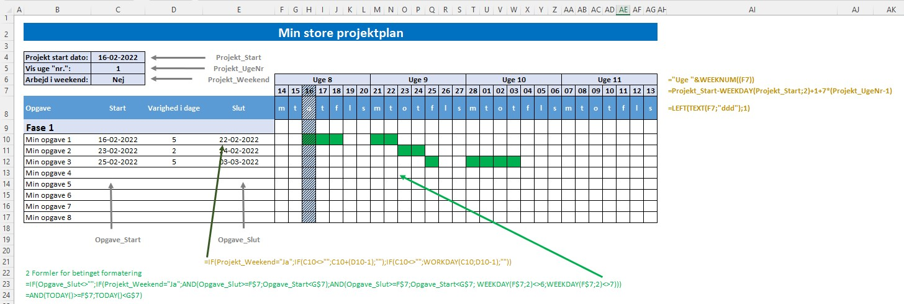

[HOME](./README.md){: .btn .btn-blue }

# Gantt
Et Gantt diagram er en oversigt, som viser hvert skridt, der skal tages for at gennemføre et projekt fra A til Z. 
Et Gantt diagram viser samtidigt projektlederens tilgang til projektet, projektets start og slut datoer, leverancer og fremdrift.

### Hvorfor lave et Gantt diagram?
Succesfulde projekter har alle en ting til fælles, de har en konkret plan fra starten. I nogle tilfælde ændres planen undervejs i et projekt, hvilket er helt fint, hvis det viser sig, at den oprindelige plan ikke var korrekt, eller at der var bedre muligheder end oprindeligt specificeret.

*Denne plan vises bedst i et Gantt diagram*

Her viser jeg dig hvordan du kan bruge Excel til at oprette et Gantt diagram.

## Gantt Skabelon
For at gøre det nemmere har jeg oprettet en skabelon du kan bruge som udgangspunkt for oprettelsen af dit Gantt diagram. Denne skabelon kan du hente *fuldt færdig* eller uden *formler* og *betinget formatering*.

Jeg vil anbefale at du henter versionen uden *formler* og *betinget formatering* og selv opretter dette.

- [Gantt_Studerende_Start.xlsx](../filer/Gantt_Studerende_Start.xlsx)
- [Gantt_Studerende_Slut.xlsx](../filer/Gantt_Studerende_Slut.xlsx)

## Projekt info
Først skal du have oprette *grund indstillinger* for projektet:

- Start dato
- Hvilken del af diagrammet vil du se?
- Bliver der udført arbejde i weekender?

<iframe src="https://www.loom.com/embed/905c08006a31473fa575d3da39ea1eca" frameborder="0" webkitallowfullscreen mozallowfullscreen allowfullscreen style="position: absolute; top: 0; left: 0; width: 100%; height: 100%;"></iframe>

## Opgave info
Du skal indtaste information omkring de enkelte opgaver:

- Opgave
- Start
- Varighed i dage
- Slut

Desuden skal du overveje hvordan de enkelte opgaver hænger sammen. Nogle opgaver skal være færdige før andre kan starte, andre opgaver kan afvikles parallelt. Som udgangspunkt sætter jeg her opgaver til at være i forlængelse af hinanden - *Den ene skal være færdig før den næste kan starte*. Dette kan du selv ændre efter behov.

<iframe src="https://www.loom.com/embed/49a6239ed0754368975b3f33ee7a03a2" frameborder="0" webkitallowfullscreen mozallowfullscreen allowfullscreen style="position: absolute; top: 0; left: 0; width: 100%; height: 100%;"></iframe>

### Navngivning
For at gøre det nemmere at referer til cellerne med, *Opgave Start* og *Opgave Slut* navngivne skal disse områder *navngives*. De to navne er defineret som:

- **Opgave_Start** = $C10 - Altså **C** kolonnen fra række 10 og *frem*
- **Opgave_Slut** =  $E10 -  Altså **E** kolonnen fra række 10 og *frem*

Måden du gør det på er ved at markere cellen **C10** for **Opgave_Start** og cellen **E10** for **Opgave_Slut**.

- Marker - **C10** eller **E10**
- Klik på fanen **Formulars**
- Klik på **Define Name** i gruppen **Define Names**
- Udfyld felterne:
    - *Name*: **Opgave_Start** eller **Opgave_Slut**
    - *Scope*: **Gantt_Start**
    - *Referes to*: **=Gantt_Start!$C10** - Det er vigtigt at du kun har **C** som absolut reference ($)

<iframe src="https://www.loom.com/embed/14f6b27fce454686913cc90dac1a9cab" frameborder="0" webkitallowfullscreen mozallowfullscreen allowfullscreen style="position: absolute; top: 0; left: 0; width: 100%; height: 100%;"></iframe>

## Kalender
Det er nødvendigt med en styring og visning af:

- ugedag
- dato
- *uge nr.* der skal vises, starten på projektet sætte til "*uge 1*" = 1 osv.

<iframe src="https://www.loom.com/embed/fe0541b7b9c844b09c0d0b192a4df0df" frameborder="0" webkitallowfullscreen mozallowfullscreen allowfullscreen style="position: absolute; top: 0; left: 0; width: 100%; height: 100%;"></iframe>

## Gantt Visning
Den vigtigste del af et Gantt diagram er den grafiske visning, her brugere jeg *betinget formatering* til at oprette visningen.

Den betingede formatering er udført med to formler, en for *DagsDato* og en der viser *opgaverne*:

### DagsDato
Det kan være en god ting at have en markering for DagsDato, det kan du også bruge betinget formatering til:

Brug denne formel:

    =AND(TODAY()>=F$7;TODAY()<G$7)

### Grøn - *Opgaverne*
Hvis der skal udføres arbejde på en given dato skal denne farves grøn.

Den samlede formel for den betingede formatering er:

    =IF(Opgave_Slut<>"";IF(Projekt_Weekend="Ja";AND(Opgave_Slut>=F$7;Opgave_Start<G$7);AND(Opgave_Slut>=F$7;Opgave_Start<G$7; WEEKDAY(F$7;2)<>6;WEEKDAY(F$7;2)<>7)))

<iframe src="https://www.loom.com/embed/a9bb69a84d8c48e0afc1a827b469131a" frameborder="0" webkitallowfullscreen mozallowfullscreen allowfullscreen style="position: absolute; top: 0; left: 0; width: 100%; height: 100%;"></iframe>

Det første check er om der står noget i **Opgave_Slut**, hvilket gøres med starten på IF-sætningen **Opgave_Slut<>"";** - Hvis det **ikke** er tilfældet, skal der ikke fortages en formatering

Det andet check er om **weekender skal inkluderes**, hvilket gøres med den næste IF-sætning
- **IF(Projekt_Weekend="Ja";**

Hvis der **skal arbejdes i weekender**, er der kun 2 betingelser der skal værre opfyldt. 

- Opgave_Slut skal være lig med eller større end den dato der står i cellen **F7**
- Opgave_Slut skal være mindre end den dato der står i **G7**
- **AND(Opgave_Slut>=F$7; Opgave_Start<G$7)**

Hvis der **ikke skal arbejdes i weekender**, er der 4 betingelser der skal være opfyldt, 2 af den er de sammen som hvis der arbejdes i weekender. De 2 andre er et check om dato i **F7** er en *lørdag* eller *søndag*
- **AND(Opgave_Slut>=F$7; Opgave_Start<G$7; WEEKDAY(F$7;2)<>6;WEEKDAY(F$7;2)<>7**

Vælg f.eks. farven grøn som baggrund

## Samlet oversigt
Oversigt over:
- Navngivne områder
- Formler til "data"
- Formler til betinget formatering

## Microsoft Guide
Microsoft har en skabelon til oprettelse af Gantt diagrammer.

- [Gantt-projektplanlægger - Microsoft DK](https://templates.office.com/da-dk/gantt-projektplanl%c3%a6gger-tm02887601)
- [Præsentere dine data i et Gantt-diagram i Excel](https://support.microsoft.com/da-dk/office/pr%C3%A6sentere-dine-data-i-et-gantt-diagram-i-excel-f8910ab4-ceda-4521-8207-f0fb34d9e2b6)
- [Brug af en guide til at oprette et Gantt-diagram - Microsoft DK](https://support.microsoft.com/da-dk/office/brug-af-en-guide-til-at-oprette-et-gantt-diagram-90ddd935-b0ab-412c-aebc-874f309f6b26)
