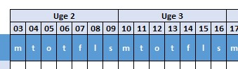

[HOME](./README.md){: .btn .btn-blue }

# Excel online - 17-02-2022
Fokus på denne online undervisning vil være følgende emner:

- Gantt diagrammer i Excel
- Tabeller
- Pivot Tabeller
- Pivot Diagrammer
- Slicer
- Timeline

# Gantt
Et Gantt diagram er en oversigt, som viser hvert skridt, der skal tages for at gennemføre et projekt fra A til Z. 
Et Gantt diagram viser samtidigt projektlederens tilgang til projektet, projektets start og slut datoer, leverancer og fremdrift.

### Hvorfor lave et Gantt diagram?
Succesfulde projekter har alle en ting til fælles, de har en konkret plan fra starten. I nogle tilfælde ændres planen undervejs i et projekt, hvilket er helt fint, hvis det viser sig, at den oprindelige plan ikke var korrekt, eller at der var bedre muligheder end oprindeligt specificeret.

*Denne plan vises bedst i et Gantt diagram*

Her viser jeg dig hvordan du kan bruge Excel til at oprette et Gantt diagram.

## Gantt Skabelon
For at gøre det nemmere har jeg oprettet en skabelon du kan bruge som udgangspunkt for oprettelsen af dit Gantt diagram. Denne skabelon kan du hente *fuldt færdig* eller uden *formler* og *betinget formatering*.

Jeg vil anbefale at du henter versionen uden *formler* og *betinget formatering* og selv opretter dette.

- [Gantt_Studerende_Start.xlsx](../filer/Gantt_Studerende_Start.xlsx)
- [Gantt_Studerende_Slut.xlsx](../filer/Gantt_Studerende_Slut.xlsx)

## Projekt info
Først skal du have oprette *grund indstillinger* for projektet:

- Start dato
- Hvilken del af diagrammet vil du se?
- Bliver der udført arbejde i weekender?

<iframe src="https://www.loom.com/embed/905c08006a31473fa575d3da39ea1eca" frameborder="0" webkitallowfullscreen mozallowfullscreen allowfullscreen style="position: absolute; top: 0; left: 0; width: 100%; height: 100%;"></iframe>

## Opgave info
Du skal indtaste information omkring de enkelte opgaver:

- Opgave
- Start
- Varighed i dage
- Slut

Desuden skal du overveje hvordan de enkelte opgaver hænger sammen. Nogle opgaver skal være færdige før andre kan starte, andre opgaver kan afvikles parallelt. Som udgangspunkt sætter jeg her opgaver til at være i forlængelse af hinanden - *Den ene skal være færdig før den næste kan starte*. Dette kan du selv ændre efter behov.

<iframe src="https://www.loom.com/embed/49a6239ed0754368975b3f33ee7a03a2" frameborder="0" webkitallowfullscreen mozallowfullscreen allowfullscreen style="position: absolute; top: 0; left: 0; width: 100%; height: 100%;"></iframe>

### Navngivning
For at gøre det nemmere at referer til cellerne med, *Opgave Start* og *Opgave Slut* navngivne skal disse områder *navngives*. De to navne er defineret som:

- **Opgave_Start** = $C10 - Altså **C** kolonnen fra række 10 og *frem*
- **Opgave_Slut** =  $E10 -  Altså **E** kolonnen fra række 10 og *frem*

Måden du gør det på er ved at markere cellen **C10** for **Opgave_Start** og cellen **E10** for **Opgave_Slut**.

- Marker - **C10** eller **E10**
- Klik på fanen **Formulars**
- Klik på **Define Name** i gruppen **Define Names**
- Udfyld felterne:
    - *Name*: **Opgave_Start** eller **Opgave_Slut**
    - *Scope*: **Gantt_Start**
    - *Referes to*: **=Gantt_Start!$C10** - Det er vigtigt at du kun har **C** som absolut reference ($)

<iframe src="https://www.loom.com/embed/14f6b27fce454686913cc90dac1a9cab" frameborder="0" webkitallowfullscreen mozallowfullscreen allowfullscreen style="position: absolute; top: 0; left: 0; width: 100%; height: 100%;"></iframe>

## Kalender
Det er nødvendigt med en styring og visning af:

- ugedag
- dato
- *uge nr.* der skal vises, starten på projektet sætte til "*uge 1*" = 1 osv.

<iframe src="https://www.loom.com/embed/fe0541b7b9c844b09c0d0b192a4df0df" frameborder="0" webkitallowfullscreen mozallowfullscreen allowfullscreen style="position: absolute; top: 0; left: 0; width: 100%; height: 100%;"></iframe>

## Gantt Visning
Den vigtigste del af et Gantt diagram er den grafiske visning, her brugere jeg *betinget formatering* til at oprette visningen.

Den betingede formatering er udført med to formler, en for *DagsDato* og en der viser *opgaverne*:

### DagsDato
Det kan være en god ting at have en markering for DagsDato, det kan du også bruge betinget formatering til:

Brug denne formel:

    =AND(TODAY()>=F$7;TODAY()<G$7)

### Grøn - *Opgaverne*
Visningen af de forskellige opgaver er en kombination af 2 **IF** og 2 **AND** betingelser, desuden bruges de to navngivne områder: **Opgave_Start** og **Opgave_Slut**.

    =IF(Opgave_Slut<>"";IF(Projekt_Weekend="Ja";AND(Opgave_Slut>=F$7;Opgave_Start<G$7);AND(Opgave_Slut>=F$7;Opgave_Start<G$7; WEEKDAY(F$7;2)<>6;WEEKDAY(F$7;2)<>7)))

<iframe src="https://www.loom.com/embed/a9bb69a84d8c48e0afc1a827b469131a" frameborder="0" webkitallowfullscreen mozallowfullscreen allowfullscreen style="position: absolute; top: 0; left: 0; width: 100%; height: 100%;"></iframe>

- **IF(Opgave_Slut<>""** - *checker om der findes en opgave i denne række*
- **IF(Projekt_Weekend="Ja"** - *checker om weekender skal med eller ej*
- *Hvis der* **arbejdes** *i weekender*
    - **AND(Opgave_Slut>=F$7**
    - **Opgave_Start<G$7)**
    - **AND(Opgave_Slut>=F$7**
    - **Opgave_Start<G$7**
- *Hvis der* **ikke** *arbejdes i weekender*
    - **WEEKDAY(F$7;2)<>6**
    - **WEEKDAY(F$7;2)<>7**

Vælg f.eks. farven grøn som baggrund

## Microsoft Guide
Microsoft har en skabelon til oprettelse af Gantt diagrammer.

- [Gantt-projektplanlægger - Microsoft DK](https://templates.office.com/da-dk/gantt-projektplanl%c3%a6gger-tm02887601)
- [Præsentere dine data i et Gantt-diagram i Excel](https://support.microsoft.com/da-dk/office/pr%C3%A6sentere-dine-data-i-et-gantt-diagram-i-excel-f8910ab4-ceda-4521-8207-f0fb34d9e2b6)
- [Brug af en guide til at oprette et Gantt-diagram - Microsoft DK](https://support.microsoft.com/da-dk/office/brug-af-en-guide-til-at-oprette-et-gantt-diagram-90ddd935-b0ab-412c-aebc-874f309f6b26)

# Tabeller
Når du skal arbejde med data i Excel er det en klar fordel at disse data er *formateret* som en tabel. Det gør det nemmere at opdatere, formatere og anvende data.

## Filer
Jeg har en fil jeg brugere til resten af dagen, den indeholder 4 ark med data der ikke er formateret. Data er egnet til både tabeller, Pivot Tabeller og Pivot Diagrammer.

Der er 2 versioner af denne fil:

- [Start - Excel_Dag_3_Start.xlsx](../filer/Excel_Dag_3_Start.xlsx)
- [Færdig - ]()

## Oprettelse af tabeller
Det er relativt simpelt at oprette en tabel, **husk** at give den et navn.

<iframe src="https://www.loom.com/embed/5401bbaf1a38464c95f42ce52fd5c78a" frameborder="0" webkitallowfullscreen mozallowfullscreen allowfullscreen style="position: absolute; top: 0; left: 0; width: 100%; height: 100%;"></iframe>

## Filer & ekstra "felter"
Vi skal bruge nogle ekstra *felter*.

<iframe src="https://www.loom.com/embed/04a4551306f843b3ae2b460e57277d5d" frameborder="0" webkitallowfullscreen mozallowfullscreen allowfullscreen style="position: absolute; top: 0; left: 0; width: 100%; height: 100%;"></iframe>

## Microsoft
Microsoft har oprettet nogle guider til oprettelse af tabeller:
- [Introduktion til tabeller](https://support.microsoft.com/da-dk/office/introduktion-til-tabeller-78ff21ea-2f76-4fb0-8af6-c318d1ee0ea7)
- [Indsæt en tabel](https://support.microsoft.com/da-dk/office/introduktion-til-tabeller-78ff21ea-2f76-4fb0-8af6-c318d1ee0ea7)
- [Opret og formatér tabeller](https://support.microsoft.com/da-dk/office/opret-og-format%C3%A9r-tabeller-e81aa349-b006-4f8a-9806-5af9df0ac664)

# Pivot Tabeller
En **Pivot Tabel** er et meget effektivt værktøj til at *beregne*, *opsummere* og *analysere* data. En Pivot Tabel gør det muligt at se mønstre og tendenser i dine data.

## Salg pr. Medarbejder / Afdeling
*Hvad hvis du gerne vil se salget pr. medarbejder og slaget pr. afdeling?*

Svaret er  - **Opret en Pivot Tabel!**

Det er den tabel du lige har oprette der skal bruges som grundlag for de to Pivot Tabeller.

<iframe src="https://www.loom.com/embed/dd4093bb224c440295b07994fd4cadee" frameborder="0" webkitallowfullscreen mozallowfullscreen allowfullscreen style="position: absolute; top: 0; left: 0; width: 100%; height: 100%;"></iframe>

## Microsoft
[PivotTabel - Microsoft DK](https://support.office.com/da-dk/article/oprette-en-pivottabel-for-at-analysere-regnearksdata-a9a84538-bfe9-40a9-a8e9-f99134456576?ui=da-DK&rs=da-DK&ad=DK)

# Pivot Diagrammer
Nogle gange er det svært at se det store billede, når dine ubehandlede data ikke er blevet opsummeret. Din første løsning kan være at oprette en Pivot Tabel, men ikke alle kan se tal i en tabel og det er svært hurtigt se, hvad der *foregår*. Pivot diagrammer er en god måde at føje data visualiseringer til dine data.

## Opret Pivot Diagrammer
På basis af det to Pivot Tabeller, *Salg pr. Medarbejder* og *Salg i pct. pr. afdeling* skal der oprettes to Pivot Diagrammer.

<iframe src="https://www.loom.com/embed/08eeed1ce87e4b7e9f500782bc7983b0" frameborder="0" webkitallowfullscreen mozallowfullscreen allowfullscreen style="position: absolute; top: 0; left: 0; width: 100%; height: 100%;"></iframe>

## Microsoft Guide
[Pivot Diagram - Microsoft DK](https://support.office.com/da-dk/article/opret-et-pivotdiagram-c1b1e057-6990-4c38-b52b-8255538e7b1c)

# Calculated Items
Det er muligt at oprette "*ekstra*" beregnede felter i en Pivot Tabel.

Mit eksempel er *Provision på 10%* ud fra hver medarbejderes salg, fordelt på kvartaler. Desuden er der fortaget en **gruppe** opdeling.

<iframe src="https://www.loom.com/embed/240adef6e8074344b1b905ede77cb1a9" frameborder="0" webkitallowfullscreen mozallowfullscreen allowfullscreen style="position: absolute; top: 0; left: 0; width: 100%; height: 100%;"></iframe>

# Middel omsætning
Jeg kunne godt tænke mig en et Pivot søjlediagram der viser følgende:

- Middel omsætningen
- Omsætning pr. mdr
- Om denne omsætning er over eller under middel

Til det vil jeg bruge en Pivot Tabel, ekstra data der udvider Pivot Tabellen og et diagram.

# Slicer
En *Slicer* gør det nemt for brugeren at udvælge/filtrer de data man vil se. En *Slicer* viser også brugeren den aktuelle filtrerings tilstand, hvilket gør det nemt at forstå, hvad der vises.

## Microsoft Guide
[Slicer - Microsoft US](https://support.microsoft.com/en-us/office/use-slicers-to-filter-data-249f966b-a9d5-4b0f-b31a-12651785d29d)

# Timeline
I stedet for at justere filtre for at få vist datoer kan du bruge en tidslinje i en pivottabel – en dynamisk filtrerings indstilling, hvor du kan nemt kan filtrere efter dato/klokkeslæt og zoome ind på det ønskede tidsrum ved hjælp af et *skyder kontrol element*. 

Klik på **Analysér** > Indsæt en Tidslinje for at indsætte en på regnearket.

## Microsoft Guide
- [PivotTabel Tidslinje - Microsoft DK](https://support.office.com/da-dk/article/opret-en-pivottabel-tidslinje-til-at-filtrere-datoer-d3956083-01be-408c-906d-6fc99d9fadfa)
- [PivotTabel Tidslinje - Microsoft US](https://support.microsoft.com/en-us/office/create-a-pivottable-timeline-to-filter-dates-d3956083-01be-408c-906d-6fc99d9fadfa)
