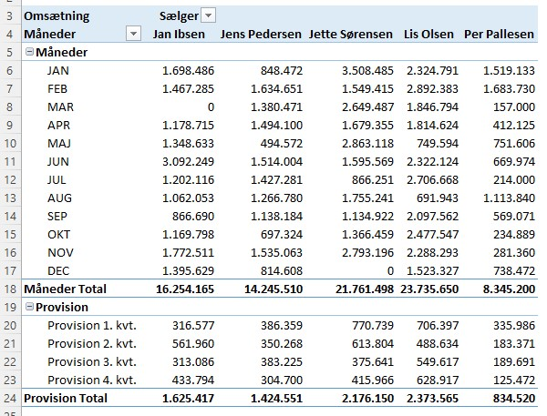
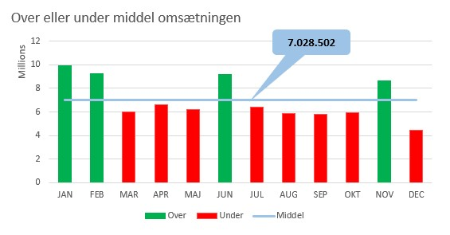

[HOME](./README.md){: .btn .btn-blue }

layout: default
title: Tabeller og Pivot Tabeller
nav_order: 20
parent: Excel

# Tabeller
Når du skal arbejde med data i Excel er det en klar fordel at disse data er *formateret* som en tabel. Det gør det nemmere at opdatere, formatere og anvende data.

## Filer
Jeg har en fil jeg brugere til resten af dagen, den indeholder 4 ark med data der ikke er formateret. Data er egnet til både tabeller, Pivot Tabeller og Pivot Diagrammer.

Der er 2 versioner af denne fil:

- [Start - Excel_Dag_3_Start.xlsx](../filer/Excel_Dag_3_Start.xlsx)
- [Færdig - Excel_Dag_3_Slut.xlsx](../filer/Excel_Dag_3_Slut.xlsx)

## Oprettelse af tabeller
Det er relativt simpelt at oprette en tabel, **husk** at give den et navn.

<iframe src="https://www.loom.com/embed/5401bbaf1a38464c95f42ce52fd5c78a" frameborder="0" webkitallowfullscreen mozallowfullscreen allowfullscreen style="position: absolute; top: 0; left: 0; width: 100%; height: 100%;"></iframe>

## Filer & ekstra "felter"
Vi skal bruge nogle ekstra *felter*.

<iframe src="https://www.loom.com/embed/04a4551306f843b3ae2b460e57277d5d" frameborder="0" webkitallowfullscreen mozallowfullscreen allowfullscreen style="position: absolute; top: 0; left: 0; width: 100%; height: 100%;"></iframe>

## Microsoft
Microsoft har oprettet nogle guider til oprettelse af tabeller:
- [Introduktion til tabeller](https://support.microsoft.com/da-dk/office/introduktion-til-tabeller-78ff21ea-2f76-4fb0-8af6-c318d1ee0ea7)
- [Indsæt en tabel](https://support.microsoft.com/da-dk/office/introduktion-til-tabeller-78ff21ea-2f76-4fb0-8af6-c318d1ee0ea7)
- [Opret og formatér tabeller](https://support.microsoft.com/da-dk/office/opret-og-format%C3%A9r-tabeller-e81aa349-b006-4f8a-9806-5af9df0ac664)

# Pivot Tabeller
En **Pivot Tabel** er et meget effektivt værktøj til at *beregne*, *opsummere* og *analysere* data. En Pivot Tabel gør det muligt at se mønstre og tendenser i dine data.

## Salg pr. Medarbejder / Afdeling
*Hvad hvis du gerne vil se salget pr. medarbejder og slaget pr. afdeling?*

Svaret er  - **Opret en Pivot Tabel!**

Det er den tabel du lige har oprette der skal bruges som grundlag for de to Pivot Tabeller.

<iframe src="https://www.loom.com/embed/dd4093bb224c440295b07994fd4cadee" frameborder="0" webkitallowfullscreen mozallowfullscreen allowfullscreen style="position: absolute; top: 0; left: 0; width: 100%; height: 100%;"></iframe>

## Microsoft
[PivotTabel - Microsoft DK](https://support.office.com/da-dk/article/oprette-en-pivottabel-for-at-analysere-regnearksdata-a9a84538-bfe9-40a9-a8e9-f99134456576?ui=da-DK&rs=da-DK&ad=DK)

# Pivot Diagrammer
Nogle gange er det svært at se det store billede, når dine ubehandlede data ikke er blevet opsummeret. Din første løsning kan være at oprette en Pivot Tabel, men ikke alle kan se tal i en tabel og det er svært hurtigt se, hvad der *foregår*. Pivot diagrammer er en god måde at føje data visualiseringer til dine data.

## Opret Pivot Diagrammer
På basis af det to Pivot Tabeller, *Salg pr. Medarbejder* og *Salg i pct. pr. afdeling* skal der oprettes to Pivot Diagrammer.

<iframe src="https://www.loom.com/embed/08eeed1ce87e4b7e9f500782bc7983b0" frameborder="0" webkitallowfullscreen mozallowfullscreen allowfullscreen style="position: absolute; top: 0; left: 0; width: 100%; height: 100%;"></iframe>

## Microsoft Guide
[Pivot Diagram - Microsoft DK](https://support.office.com/da-dk/article/opret-et-pivotdiagram-c1b1e057-6990-4c38-b52b-8255538e7b1c)

# Calculated Items
Det er muligt at oprette "*ekstra*" beregnede felter i en Pivot Tabel.

Mit eksempel er *Provision på 10%* ud fra hver medarbejderes salg, fordelt på kvartaler. Desuden er der fortaget en **gruppe** opdeling.

<iframe src="https://www.loom.com/embed/240adef6e8074344b1b905ede77cb1a9" frameborder="0" webkitallowfullscreen mozallowfullscreen allowfullscreen style="position: absolute; top: 0; left: 0; width: 100%; height: 100%;"></iframe>

# Middel omsætning
Jeg kunne godt tænke mig en et Pivot søjlediagram der viser følgende:

- Middel omsætningen
- Omsætning pr. mdr
- Om denne omsætning er over eller under middel

Til det vil jeg bruge en Pivot Tabel, ekstra data der udvider Pivot Tabellen og et diagram.

<iframe src="https://www.loom.com/embed/36bc487b77a3431089aaec6fedcb5948" frameborder="0" webkitallowfullscreen mozallowfullscreen allowfullscreen style="position: absolute; top: 0; left: 0; width: 100%; height: 100%;"></iframe>

# Slicer
En *Slicer* gør det nemt for brugeren at udvælge/filtrer de data man vil se. En *Slicer* viser også brugeren den aktuelle filtrerings tilstand, hvilket gør det nemt at forstå, hvad der vises.

<iframe src="https://www.loom.com/embed/04743cdafb1142c3ba9859f5b0e21dab" frameborder="0" webkitallowfullscreen mozallowfullscreen allowfullscreen style="position: absolute; top: 0; left: 0; width: 100%; height: 100%;"></iframe>

## Microsoft Guide
[Slicer - Microsoft US](https://support.microsoft.com/en-us/office/use-slicers-to-filter-data-249f966b-a9d5-4b0f-b31a-12651785d29d)

# Timeline
I stedet for at justere filtre for at få vist datoer kan du bruge en tidslinje i en pivottabel – en dynamisk filtrerings indstilling, hvor du kan nemt kan filtrere efter dato/klokkeslæt og zoome ind på det ønskede tidsrum ved hjælp af et *skyder kontrol element*. 

Klik på **Analysér** > Indsæt en Tidslinje for at indsætte en på regnearket.

<iframe src="https://www.loom.com/embed/78a7fae0e21a422688c008cbc329fc65" frameborder="0" webkitallowfullscreen mozallowfullscreen allowfullscreen style="position: absolute; top: 0; left: 0; width: 100%; height: 100%;"></iframe>

## Microsoft Guide
- [PivotTabel Tidslinje - Microsoft DK](https://support.office.com/da-dk/article/opret-en-pivottabel-tidslinje-til-at-filtrere-datoer-d3956083-01be-408c-906d-6fc99d9fadfa)
- [PivotTabel Tidslinje - Microsoft US](https://support.microsoft.com/en-us/office/create-a-pivottable-timeline-to-filter-dates-d3956083-01be-408c-906d-6fc99d9fadfa)
