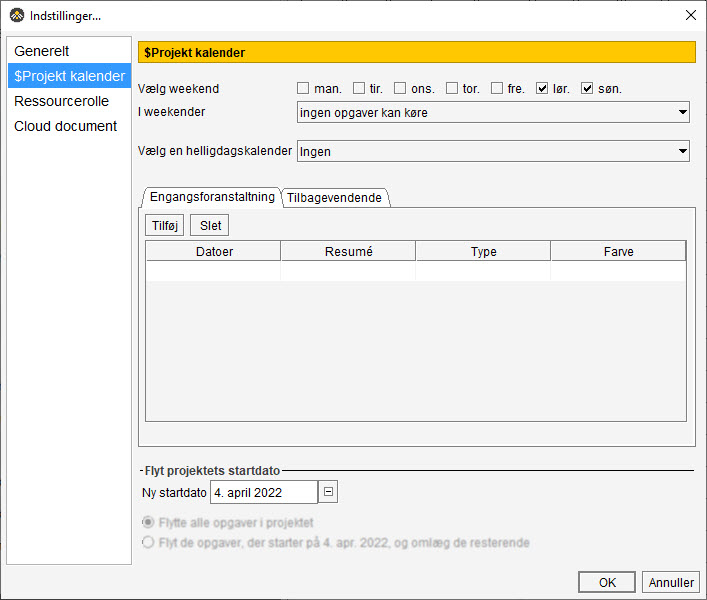
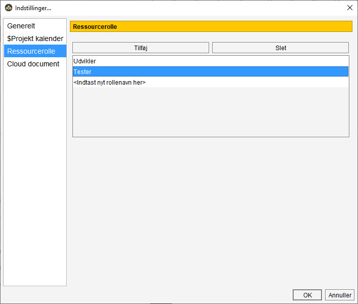
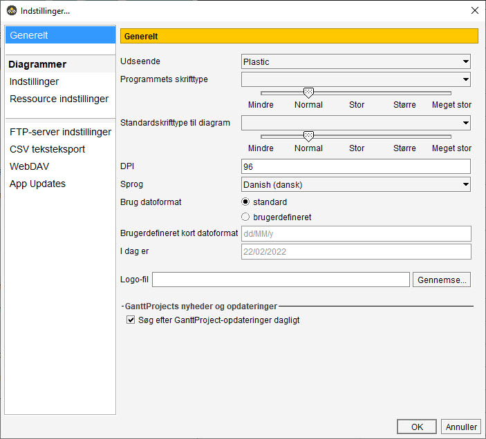
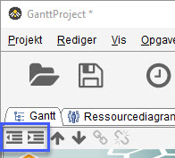
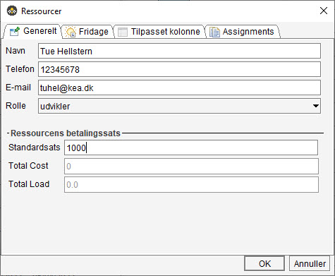

[HOME](./README.md){: .btn .btn-blue }

# GanttProject

- Easy to start
    - No complex set-up. GanttProject is ready to work immediately after launching.
- Clean user interface
    - Simple uncluttered workspace with the task break-down table on the left and Gantt chart on the right side.
- Data exchange
    - Export documents to **Microsoft Project format** and import existing documents. 
    - Export to CSV or Excel for data processing. 
    - Export to PDF or PNG to produce reports or printable charts.

## Download
Du kan hente **GanttProject** her - [Download](https://www.ganttproject.biz/download/gp30)

## It is free of charge
You can choose paid download and we'll appreciate it. However, all GanttProject packages are available for free and are identical to paid ones.

### Open-source code
GanttProject is distributed under GPL3 license. You can download the source code, modify it and redistribute under the terms of GPL3.

# Indstillinger
Der er to steder du kan ændre indstillinger:

- **Projekt** > Indstillinger
- **Rediger** > Indstillinger

## Projekt > indstillinger
Projekt indstillinger er opdelt i følgende:

- Generelt
- Projekt kalender
- Ressourcerolle
- Cloud document

På denne kursus er det kun **Projekt kalender** og **Ressourcerolle** vil kommer til at berører.

### Projekt kalender
Du har mulighed for indstille om der arbejdes i weekender, helligdage og specielle virksomheds-dage. Desværre er det ikke muligt at importere en dansk helligdags kalender, så den skal du selv oprette.

Det er også her du kan flytte hele projektets startdato

### Ressourcerolle
Dine ressourcer kan opdeles i forskellige *roller*. Disse roller defineres her, kunne f.eks. være:

- Udvikler
- Tester

### Rediger > indstillinger
Disse indstillinger er opdelt i:

- Generelt
- Diagrammer
- Ressource
- FTP-server indstillinger
- CSV eksport
- WebDAV server
- App Updates

# Importer
Det er muligt at *importere* følgende fil formater til GanttProject:

- Microsoft Project
- iCalendar
- Tekst .txt & .csv

Du finder **Importer** under **Projekt**  

# Eksporter
Det er muligt at eksportere til følgende fil formater:

- Microsoft Project
- HTML
- PDF
- Raster billede format
- CSV

Du finder **Eksporter** under **Projekt** 

# Opgaver
Du kan opretter **opgaver** på flere måder:

- Opgave > Ny Opgave
- CTRL + T
- Klik på "*Ur symbolet*"

## Hoved/Under - opgaver
Du kan gøre en opgave til **Under opgave** ved at rykke den ind under det der skal være **Hoved opgaven**. Det gør du ved at bruge det *indryknings symbolet*

# Ressourcer
Du kan oprette **Ressourcer** på flere måder:

- Ressourcer > Ny Ressource
- CTRL + H
- Klik på "*Person symbolet*"

# Cloud
- Der findes også en Cloud version af GanttProject - [Se mere her](https://ganttproject.cloud/)
- Cloud løsningen kan synkroniseres med Desktop løsningen

*GanttProject Cloud IS NOT (yet) a web service for drawing Gantt charts. You need to use GanttProject Desktop to edit your projects.*

Vejledning til hvordan du brugere og indstille deres cloud løsning kan du finde her[https://help.ganttproject.biz/t/ganttproject-cloud-docs/1954](https://help.ganttproject.biz/t/ganttproject-cloud-docs/1954)

# Video
Her er nogle YouTube videoer omkring GanttProject

## Manage Project and Tasks Free, Easy and Fast with GanttProject Software
<iframe width="560" height="315" src="https://www.youtube.com/embed/ZIEyU5fXnzA" title="YouTube video player" frameborder="0" allow="accelerometer; autoplay; clipboard-write; encrypted-media; gyroscope; picture-in-picture" allowfullscreen></iframe>

## Gantt Project Intro and Tutorial
<iframe width="560" height="315" src="https://www.youtube.com/embed/Hkl36PFJnDM" title="YouTube video player" frameborder="0" allow="accelerometer; autoplay; clipboard-write; encrypted-media; gyroscope; picture-in-picture" allowfullscreen></iframe>  

## Gantt Project Tutorial
<iframe width="560" height="315" src="https://www.youtube.com/embed/fxhYf4llXkE" title="YouTube video player" frameborder="0" allow="accelerometer; autoplay; clipboard-write; encrypted-media; gyroscope; picture-in-picture" allowfullscreen></iframe>

## GanttProject Tutorial
<iframe width="560" height="315" src="https://www.youtube.com/embed/5FukJpd_VNs" title="YouTube video player" frameborder="0" allow="accelerometer; autoplay; clipboard-write; encrypted-media; gyroscope; picture-in-picture" allowfullscreen></iframe>
