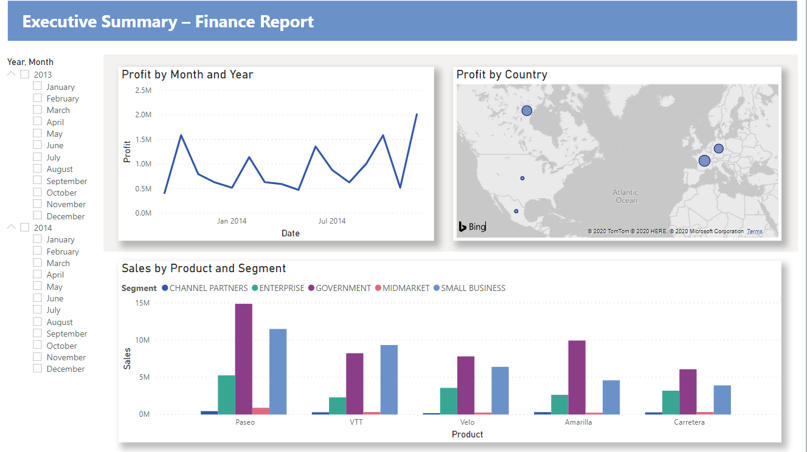
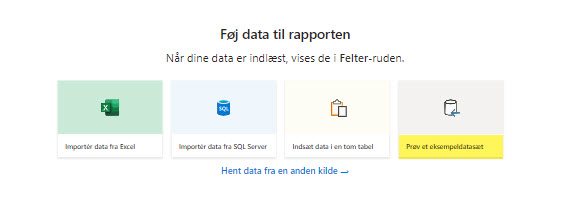

# Financial Sample Excel workbook for Power BI
Microsoft have a simple Excel workbook of sample financial data.

This workbook has a table of sales and profit data sorted by market segment and country.

## Download it directly
You can download it directly: [Financial Sample Excel workbook](https://go.microsoft.com/fwlink/?LinkID=521962)

# Get the sample in Power BI Desktop
You can also download it from Power BI Desktop. Select Try a sample dataset from the yellow welcome screen or from the blank canvas.

# Next steps
Here are two tutorials that use this Financial sample data:

- [Power BI Desktop: From Excel workbook to stunning report](https://learn.microsoft.com/en-us/power-bi/create-reports/desktop-excel-stunning-report)
- [Power BI service: From Excel workbook to stunning report](https://learn.microsoft.com/en-us/power-bi/create-reports/service-from-excel-to-stunning-report)