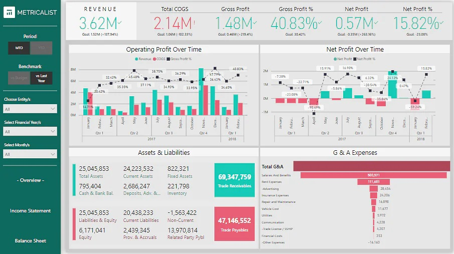
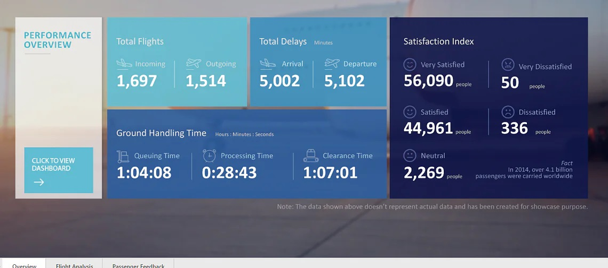

  

    Table of contents
  

  {: .text-delta }
1. TOC
{:toc}

# Financial Performance Analysis
Financial performance analysis is a normal task for Power BI. 

Refer to the multi-company financial dataset available on Kaggle - [Link](https://www.kaggle.com/qks1lver/financial-data-of-4400-public-companies)

You can leverage Power BI data visualization in this project for three different cases:

- For the summary/overview page, you can use Funnel Charts, Combo Charts (*Column Charts, Line Charts, Waterfall Charts*)
- For the income statement page, you can use Cards, Funnel Charts, and Combo Charts (*Line Charts and Column Charts*)
- For the balance sheet page, you can use Cards and Tables.

# Product Sales Data Analysis
Businesses must keep detailed records of their sales for a variety of reasons. However, if there is too much data, it often becomes difficult to keep track of everything.

Analyzing sales data allows companies to keep track of their sales and answer all critical questions regarding their performance.

This sales data analysis project entails analyzing a company's sales data and indicating profit by product, sales, and other significant factors that might influence the company's performance. 

You can use [Microsoft's sample dataset](https://docs.microsoft.com/en-us/power-bi/create-reports/sample-financial-download). The data set must be connected to Power BI Desktop to remove irrelevant data before visualizing and exporting the filtered data as dashboards. 

The dashboard could leverage Power BI visualization types such as Pie Charts, Bar Charts, Doughnut Charts, Funnel Charts, etc.

# Marketing Campaign Insights Analysis
Use the [Marketing Analytics dataset](https://www.kaggle.com/jackdaoud/marketing-data) available on Kaggle to showcase the efficacy of various marketing campaigns and the performance of product groups and platforms using any marketing analytics dataset.

For the data visualization dashboard, you can explore many of the Power BI visualization types, such as Bar Charts for category-wise expenditures, Column Charts for campaign success rate, Smart Narratives for displaying the key highlights of the campaign, Bubble Charts for customer-wise spending, Cards for showing individual data insights, etc.

# Airport Authority Data Analysis
The Airport Authority Data Analysis project aims to provide a clear picture of all the significant airport data. The total number of flights (*incoming and departing flights*), the total number of flight delays (*arrivals and departures*), ground processing time, and the passenger feedback section can all be included in the summary page of this project’s dashboard. 

In case of flight changes, emergencies, or delays, this analysis could assist airport management authorities in making timely data-driven choices.

Use the [Airline delays and cancellation dataset](https://www.kaggle.com/yuanyuwendymu/airline-delay-and-cancellation-data-2009-2018) available on Kaggle. 

The dataset includes multi-year airline data from 2009 to 2018 to provide more time-series insights. 

For flight analysis, you can use Power BI visualization options like Cards, Bar Charts, Flow Maps, TreeMaps, and Tornado Charts. For passenger feedback, you might prefer to use Bar Charts, Column Charts, or Cards.

# Global Energy Trade Analysis
For this  project, use the [International Energy Statistics](https://www.kaggle.com/unitednations/international-energy-statistics?select=all_energy_statistics.csv) dataset from Kaggle. It addresses several topics, such as the expansion of wind energy, energy consumption as a different basis for comparing national economies, etc.

The resulting dashboard could display total energy statistics on production, exchange, and usage of primary and secondary energy, conventional and non-conventional energy sources, and new and renewable energy sources. 

For the dashboard, you can use Power BI visualization types such as Bar Charts, Flow Maps, Cards for the overview page, Ribbon Charts, Treemaps, Bar Charts for the energy production and exchange pages, etc.

# AdventureWorks Database Analysis
Use the AdventureWorks data available on GitHub for analysis & visualization. 

Use Power BI for the visualization part, use MS Excel and Power BI's query editor for analysis.

[AdventureWorks Database on GitHub](https://github.com/AhmadSabbirChowdhury/Microsoft-AdventureWorks-Database-Analysis-Visualization-with-PowerBI)
