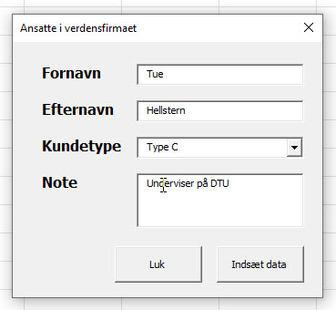

<span class="fs-1">
[HOME](../README.md){: .btn .btn-blue }
</span>
# VBA
VBA bruges rigtig meget i Excel og det er også i Excel du primært kommer til at bruge VBA.

Microsoft har en *Getting started with VBA in Office* guide, den er på engelsk, men giver et rigtigt godt overblik.

[Getting started with VBA in Office](https://docs.microsoft.com/en-us/office/vba/library-reference/concepts/getting-started-with-vba-in-office?irgwc=1&OCID=AID681541_aff_7806_1246483&tduid=(ir__snukbsnj6wv13yycus23kguo3u2xm9ybeexehznx00)(7806)(1246483)(%28f5d2667ddccb4999bcba81444ccf4381%29%2881561%29%28686431%29%28at106140_a107739_m12_p12460_cDK%29%28%29)(f5d2667ddccb4999bcba81444ccf4381)&irclickid=_snukbsnj6wv13yycus23kguo3u2xm9ybeexehznx00)

## Udvikler fanen
Der er en ekstra fane du vil have glæde af når du arbejder med VBA i Excel - **Udvikler** (Developer).

Du aktivere den på følgende måde:

1. Filer
2. Indstillinger
3. Tilpas båndet
4. Sæt hak ud for *Udvikler*
5. Klik Ok

### Video
<div style="position: relative; padding-bottom: 62.769230769230774%; height: 0;"><iframe src="https://www.loom.com/embed/c1a78a0aba5b4cbeaaa1f6ae6aa051da" frameborder="0" webkitallowfullscreen mozallowfullscreen allowfullscreen style="position: absolute; top: 0; left: 0; width: 100%; height: 100%;"></iframe></div>

## Makrooptageren
Det er muligt at optage dine makroer, det er dog ikke alt der kan optages. Det at optage en makro kan også bruges til at lære hvordan du programmere i VBA, f.eks. hvis du ikke ved hvordan man via VBA gør en celle's tekst fed - så kan du optage det og genbruge det i din egen kode.

Microsoft har en rigtig god guide til dette, den dækker både Windows og MacOS.

[Makro optager guide - DK version](https://support.office.com/da-dk/article/automatiser-opgaver-med-makrooptageren-974ef220-f716-4e01-b015-3ea70e64937b)

### Video
<div style="position: relative; padding-bottom: 62.769230769230774%; height: 0;"><iframe src="https://www.loom.com/embed/a79617887b3e47f9b60915a8eee42679" frameborder="0" webkitallowfullscreen mozallowfullscreen allowfullscreen style="position: absolute; top: 0; left: 0; width: 100%; height: 100%;"></iframe></div>

## Afvikling af makroer
Når du har optaget dine makroer skal de også afvikles. Det kan gøres på flere forskellige måder.

- Under *View - Macros*
- I Developer fanen - *Macros*
- Knap i et Excel ark

### Video
<div style="position: relative; padding-bottom: 62.769230769230774%; height: 0;"><iframe src="https://www.loom.com/embed/f1a4cc72f2714ffc8db536f1e516dff3" frameborder="0" webkitallowfullscreen mozallowfullscreen allowfullscreen style="position: absolute; top: 0; left: 0; width: 100%; height: 100%;"></iframe></div>

## Gemme en Excel fil makroer
Når du skal gemme en Excel der indeholder makroer er det vigtigt at den gemmes i formatet - **Macro-Enabled Workbook (*.xlsm)**

### Video
<div style="position: relative; padding-bottom: 62.769230769230774%; height: 0;"><iframe src="https://www.loom.com/embed/284472761cb840aba2c6f9439897b9be" frameborder="0" webkitallowfullscreen mozallowfullscreen allowfullscreen style="position: absolute; top: 0; left: 0; width: 100%; height: 100%;"></iframe></div>

## Basis elementer
VBA består af 5 basis elementer:

1. Objects
2. Collections
3. Properties
4. Methods
5. Parameters

### Objects og Collections
Du brugere *Objects* til at henvis til noget, f.eks.:

- Workbook, henviser til Workbook object
- Worksheet, henviser til Worksheet object

I nogle tilfælde er det muligt at henvise til flere *Objects* på sammen tid. Dette gøres via en *Collection*, f.eks.:

- All Open Workbooks
- All Worksheets i en Workbook

Med andre ord er *Objects* normalt grupperet i samlinger af beslægtede objekter, f.eks.:

- Collection af ​​alle åbne workbooks i Workbooks collection
- Collection af ​​alle worksheets i en projektmappe i Worksheets collection

Du kan normalt (der er undtagelser) skelne et enkelt *Object* fra en *Collection* af objekter, fordi *Collection* indeholder "s" i slutningen, f.eks.:

- Workbook object vs. Workbook**s** collection
- Worksheet object vs. Worksheet**s** collection


### Properties
*Properties* er de egenskaber eller attributter, der beskriver et objekt. De fleste *Object* har et sæt egenskaber. Disse egenskaber bestemmer blandt andet; Udseende og Funktion

*Properties* beskriver egenskaberne eller attributterne på et *Object*, f.eks.:

- Address of a cell - **Range.Address**
- Worksheet formula within a cell - **Range.Formula**
- Height of a row of cells - **Range.Height**
- Interior color of a cell - **Interior.Color**
- Name of a worksheet - **Worksheet.Name**

### Methods
Metoder *udtrykker* en handling, du udfører med eller på et *Object*, F.eks.:

- Copy, Cut and Paste methods
- Delete method
- Sort method
- Find method

### Parameters
Parametre giver dig mulighed for yderligere at angive, hvordan:

- A method is carried out
- A property behaves or is modified

Overvej f.eks., Når du brugere indsæt special (Range.PasteSpecial). I Excel indeholder dialogboksen *Indsæt specielle* flere muligheder, som giver dig mulighed for at angive, hvordan Excel skal udfører indsætningen.

### Connect objects with properties or methods
I VBA bruger du et punktum (.) Til at forbinde:

- Object med properties - Object.Property
- Object med methods - Object.Method

### Basic structure - VBA statement
Grundlæggende kan du opdele VBA-sætninger ved at kombinere 3 elementer:

- Objects
- Punktum (.)
- Property eller Methode

Det giver dig 2 grundlæggende sætningsstrukturer:

- Object.Property - Range("A1").Font.Bold = True
- Object.Method - Range("A1").Select

## Excel Object Model
VBA er organisert i et logisk hieraki - **Excel Object Model**.
Denne en **meget** stor model med mange niveauer og forgreninger. Hver *Object* indeholder typisk andre/nye objekter.

Øverst er **Application** som repræsentere hele Excel applikationen. Den indeholder flere objekter, f.eks. *Workbook object* som indeholder *Worksheet object*, som indeholder flere andre objekter, f.eks. *Range object* og *PivotTable object*.

Dette mønster fortsætter med at udfolde sig på en lignende måde, 
indtil du støder på objekter, der ikke indeholder andre objekter.

[Object model - Excel](https://docs.microsoft.com/en-us/office/vba/api/overview/excel/object-model)

## Opgave 1
Du skal optage en makro der eksportere, alle ark i den Excel fil du har åben, som en PDF fil.

- Gem den Excel fil du har åben - *Husk formatet*
- Optag makro der eksportere alle ark som PDF
- Makroen skal gemmes i *Den aktive fil*
- Opret en knap i første ark af den Excel fil du har åben til afvikling af makroen
- Gør det også muligt at afvikle makroen via *Quick Access Toolbar*
- I første omgang giver du bare PDF et navn som den så gemmer PDF filen under - *Du kommer til at ændre det senere*

### Opgave Video
Prøv selv at optage denne makro **FØR** du ser denne video :-)

<div style="position: relative; padding-bottom: 62.769230769230774%; height: 0;"><iframe src="https://www.loom.com/embed/c5a4c85fbcdd46288dd3aafefb533bb2" frameborder="0" webkitallowfullscreen mozallowfullscreen allowfullscreen style="position: absolute; top: 0; left: 0; width: 100%; height: 100%;"></iframe></div>


## IF
[Microsoft If...Then...Else statement](https://docs.microsoft.com/en-us/office/vba/language/reference/user-interface-help/ifthenelse-statement)

# Variable
En variabel brugere du til at gennem værdier mens dit program kører.

Forskellen mellem konstanter og variabler er at konstanter har en **fast** værdi, mens variabler kan **variere** i værdien.

## Erklær en variabel eller konstant
Det er god kode stil at erklære en variabel eller konstant inden du bruger den. 

Det er godt nok frivilligt om du gør det i VBA.

At erklære den, vil sige at du definerer hvilken datatype en variabel eller konstant er.

Du erklærer en variabel med koden:

    DIM *navn* AS *datatype*

## Datatyper
En variabel eller konstant er defineret med forskellige **datatyper**.

- **byte** er en positiv talværdi mellem 0 og 255. Den fylder ca. 1 byte i hukommelsen.
- **boolean** er en værdi der enten kan være sand (true) eller falsk (false). Den fylder ca. 2 bytes.
- **integer** er en heltalsværdi mellem -32768 og +32768. Den fylder ca. 2 bytes.
 -**long** er også en heltalsværdi, men kan være mellem -2.147.483.648 og +2.147.483.648. Den fylder ca. 4 bytes.
- **single** er et decimaltal mellem -3,4e38 og +3,4e38 og fylder ca. 4 bytes.
- **double** er et decimaltal mellem -1,8e308 og +1,8e308 og fylder ca. 8 bytes.
 -**currency** er et decimaltal mellem -922.337.203.685.477,5808 og
+922.337.203.685.477,5808 og fylder ca. 8 bytes.
- **date** er en dato der kan være fra den 1. januar år 100 til den 31. december 9999. Den fylder ca. 8 bytes.
- **string** er en tekststreng der kan have op til 65.500 tegn, hvis den defineres som en konstant. Hvis den defineres som variabel, kan den have ca. 2 milliarder tegn.

## Video
<div style="position: relative; padding-bottom: 106.10526315789474%; height: 0;"><iframe src="https://www.loom.com/embed/148b5d147b7a445ca275d704fc5d012d" frameborder="0" webkitallowfullscreen mozallowfullscreen allowfullscreen style="position: absolute; top: 0; left: 0; width: 100%; height: 100%;"></iframe></div>


## Loop
LOOP eller løkker er meget brugt i programmering. Det kan f.eks. være gennemløb af data i et Excel ark.

VBA har flere forskellige typer af løkker som kan opdeles i to grupper:
- For - Next
- Do - Loop

Ved et For-Next loop kender du antallet af gennemløb, det kan f.eks. være alle Ark i en Excel fil. Der er to typer af For-Next loop

```vbnet
    For variabel = a TO b
        VBA Kode
    Next
    
    For Each Egenskab IN Objekt
        VBA Kode
    Next
``` 

Ved et Do-Loop udføres Loopet indtil en betingelse er opfyldt
Der er 2 hoved typer af Do-Loop. Udfør en Betingelse indtil denne er Opfyldt, eller udfør loopet så længe betingelsen er sand. Du kan starte med at skrive Betingelsen eller du kan skrive Betingelsen til sidst i loopet.

```vbnet
    Do Until Betingelse
      VBA Kode
    Loop
    
    Do While Betingelse 
      VBA Kode 
    Loop
    
    Do
      VBA Kode
    Loop Until Betingelse

    Do
      VBA Kode
    Loop While Betingelse
``` 

Hvis du har behov for at Stoppe/komme ud af et Loop før det er helt færdigt, kan du gøre det med denne kommando

```vbnet
    Exit do
    
' F.eks.
    Do Until Betingelse
      If Betingelse then
          Exit Do
      End If
    Loop
``` 
## Fejlhåndtering
Der er forskellige typer af fejl i et program. Nogle fejl opstår fordi der er en fejl i programmeringen af programmet og nogle fejl opstår via brugeren, f.eks. ved en forkert indtastning.

Error handling består af 3 "kommandoer"

1. On Error GoTO *Line / ErrorHandler:*
2. On Error Resume Next
3. On Error GoTo 0

```vbnet
    Sub InitializeMatrix(Var1, Var2, Var3, Var4) 
        On Error GoTo ErrorHandler 
             . . . 
         Exit Sub xx
        ErrorHandler: 
             . . . 
        Resume Next
    End Sub
``` 

## Video
<div style="position: relative; padding-bottom: 106.10526315789474%; height: 0;"><iframe src="https://www.loom.com/embed/d9f5cc8284c748e7b30efcb858833781" frameborder="0" webkitallowfullscreen mozallowfullscreen allowfullscreen style="position: absolute; top: 0; left: 0; width: 100%; height: 100%;"></iframe></div>


[Microsoft On Error Statement oversigt](https://docs.microsoft.com/en-us/office/vba/language/reference/user-interface-help/on-error-statement)

# Break Point
Når du afvikler din kode, specielt loop, kan det være en fordel ast kunne *følge* koden - Se/Afvikle koden linje for linje.

Det gør det muligt at finde fejl og problemer i koden.

*Brug **F8** til at steppe igennem koden*

## Video
<div style="position: relative; padding-bottom: 105.21920668058455%; height: 0;"><iframe src="https://www.loom.com/embed/67f0eba3587047aebfd674d8fd7b88e1" frameborder="0" webkitallowfullscreen mozallowfullscreen allowfullscreen style="position: absolute; top: 0; left: 0; width: 100%; height: 100%;"></iframe></div>

## MsgBox
MsgBox er en VBA dialogboks du kan bruge til at informere brugerne. De kan så svare ved at klikke på en knap.

[MsgBox function](https://docs.microsoft.com/en-us/office/vba/language/reference/user-interface-help/
msgbox-function)


# Automatisk afvikling
Indtil nu har du afviklet dine makroer manuelt. Enten via en knap eller via menuen.

Det er også muligt at afvikle makroer automatisk, det kan f.eks. være:

- Når Excel filen åbnes eller lukkes
- Før der printes
- Når et bestemt ark aktiveres
- osv.

Det giver nogle muligheder i forhold til opdatering af data og bestemte makroer du vil være sikker på bliver afviklet.

## Video
<div style="position: relative; padding-bottom: 106.10526315789474%; height: 0;"><iframe src="https://www.loom.com/embed/e03b9a088ab844efb41e786a5db80906" frameborder="0" webkitallowfullscreen mozallowfullscreen allowfullscreen style="position: absolute; top: 0; left: 0; width: 100%; height: 100%;"></iframe></div>

# Hastighed
VBA er ikke altid det hurtigste programmering sprog, men der er metoder til at optimere det.

## Video
<div style="position: relative; padding-bottom: 108.35073068893529%; height: 0;"><iframe src="https://www.loom.com/embed/f61cd6ad0f294a0fae5a383ebd7a1a19" frameborder="0" webkitallowfullscreen mozallowfullscreen allowfullscreen style="position: absolute; top: 0; left: 0; width: 100%; height: 100%;"></iframe></div>

## Kode
Den kode jeg tester hastigheden på, husk at slå *Immediate* vinduet til.
```vb
Sub Hastighed()
    Dim i As Integer
    Dim StartTid As Double
    
    ' Optimer
    Call SpeedUp(True)
    
    ' Start tid
    StartTid = Timer
    
    ' Start Celle
    Range("A1").Select
    
    For i = 1 To 100
        
        Range("A" & i).Select
        Selection.Copy

        Range("B" & i).Select
        ActiveSheet.Paste
        
'        Range("B" & i).Value = Range("A" & i).Value
                
    Next i
    
    ' Optimer
    Call SpeedUp(False)

    ' Check tid
    Debug.Print Format(Timer - StartTid, "00.00.00")

End Sub
```

Kode der optimere hastigheden
```vb
Sub SpeedUp(check As Boolean)

    If check = True Then
        With Application
            .Calculation = xlCalculationManual
            .ScreenUpdating = False
            .Cursor = xlWait
        End With
    Else
        With Application
            .Calculation = xlCalculationAutomatic
            .ScreenUpdating = True
            .Cursor = xlDefault
        End With
    End If
    
End Sub
```

## Hjælp
Det er muligt at få hjælp til en funktion som du allerede har skrevet i din kode. Dette gøres ved at stille cursoren på funktionen og trykke på F1. Det er så Microsofts hjælp til den givne funktion der bliver åbnet i en browser. Du skal være forbundet til internettet for at det virker.

<div style="position: relative; padding-bottom: 60.61538461538461%; height: 0;"><iframe src="https://www.loom.com/embed/fc04899f42af43ec8808f53e53e7bed8" frameborder="0" webkitallowfullscreen mozallowfullscreen allowfullscreen style="position: absolute; top: 0; left: 0; width: 100%; height: 100%;"></iframe></div>

### Workbook.BuiltinDocumentProperties
Du kan finde en oversigt over de muligheder der er med *Workbook.BuiltinDocumentProperties* her:

[Workbook.BuiltinDocumentProperties property](https://docs.microsoft.com/en-us/office/vba/api/excel.workbook.builtindocumentproperties)

### Video
<div style="position: relative; padding-bottom: 62.769230769230774%; height: 0;"><iframe src="https://www.loom.com/embed/3043cfa901194c3e941fe2af37b785f1" frameborder="0" webkitallowfullscreen mozallowfullscreen allowfullscreen style="position: absolute; top: 0; left: 0; width: 100%; height: 100%;"></iframe></div>

## Opgave 2
Du skal nu ændre i din PDF eksport makro.

Jeg ændrede så den gemmer med dags dato, men den skal også ændres så den gemme i den **sammen mappe** som den aktive fil.

*Bemærk at det kræver at den aktive fil er gemt!*

Her er min kode, *efter* ændringen af filnavnet - **Format(Date, "dd-mm-yyyy")**

```vb
Sub EksportPDF()

    ActiveWorkbook.ExportAsFixedFormat Type:=xlTypePDF, Filename:= _
        "C:\Users\tuehe\Documents\" & Format(Date, "dd-mm-yyyy") & ".pdf", Quality:=xlQualityStandard, _
        IncludeDocProperties:=True, IgnorePrintAreas:=False, OpenAfterPublish:= True
        
End Sub
```

Ved at bruge - **ActiveWorkbook.Path** - Skal du nu gemme PDF filen i sammen mappe som Excel filen

**Bemærk** at **ActiveWorkbook.Path** IKKE giver dig en afsluttende \

**Løsning** - *Prøv lige selv først* :-)
```vb
Sub EksportPDF()

    ActiveWorkbook.ExportAsFixedFormat Type:=xlTypePDF, Filename:= _
        ActiveWorkbook.Path & "\" & Format(Date, "dd-mm-yyyy") & ".pdf", Quality:=xlQualityStandard, _
        IncludeDocProperties:=True, IgnorePrintAreas:=False, OpenAfterPublish:= True
        
End Sub
```

# Forms
I VBA er det også muligt at oprette Forms. Der gør det nemmere for brugeren at afvikle et VBA program, men det gør det også nemmere for dig som udvikler at styrer program afviklingen og evt. data input.

[Microsoft Info](https://support.microsoft.com/da-dk/office/oversigt-over-formularer-kontrolelementer-i-formularer-activex-kontrolelementer-i-et-regneark-15ba7e28-8d7f-42ab-9470-ffb9ab94e7c2)

## Simpel Beskyt form
Den første form vi opretter er en simpel form der gør det nemt for brugeren at beskytte alle ark og fjerne denne beskyttelse igen.


### Kode
Her er koden til formen

```vb
Option Explicit

Private Sub cmdBeskyt_Click()
    Dim ws As Worksheet
    
    For Each ws In ActiveWorkbook.Worksheets
        ws.Protect
    Next ws
    
    ' Luk formen
    frmBeskyt.Hide
    
End Sub

Private Sub cmdFjernBeskyt_Click()
    Dim ws As Worksheet
    
    For Each ws In ActiveWorkbook.Worksheets
        ws.Unprotect
    Next ws
End Sub

Private Sub cmdLuk_Click()
    frmBeskyt.Hide
End Sub
```

Koden til at vise formen, skal være i et **module**:

```vb
Sub VisBeskytForm()
    frmBeskyt.Show
End Sub
```

### Video
<div style="position: relative; padding-bottom: 105.21920668058455%; height: 0;"><iframe src="https://www.loom.com/embed/38229d9d5c8c41438bfcfa73ae81801b" frameborder="0" webkitallowfullscreen mozallowfullscreen allowfullscreen style="position: absolute; top: 0; left: 0; width: 100%; height: 100%;"></iframe></div>

## Ansatte form
Formular der gør det muligt indsætte følgende informationer om ansatte via en Form:

- Fornavn
- Efternavn
- Kundetype
- Note



### Video
<div style="position: relative; padding-bottom: 105.21920668058455%; height: 0;"><iframe src="https://www.loom.com/embed/d3db0446bf8144969c10c4f8a77b0c3e" frameborder="0" webkitallowfullscreen mozallowfullscreen allowfullscreen style="position: absolute; top: 0; left: 0; width: 100%; height: 100%;"></iframe></div>

### Kode

```vb
Option Explicit

Private Sub cmdDataInd_Click()
    Dim AntalRow As Double
    
    ' Find første tomme celle
    If Range("A2").Value <> "" Then
        AntalRow = (Range("A1", Range("A1").End(xlDown)).Rows.Count) + 1
    Else
        AntalRow = 2
    End If
    
    ' Indsæt data
    Range("A" & AntalRow).Value = txtFornavn.Text
    Range("B" & AntalRow).Value = txtEfternavn.Text
    Range("C" & AntalRow).Value = cmdKundetype.Text
    Range("D" & AntalRow).Value = txtNote.Text
End Sub

Private Sub cmdLuk_Click()
    frmAnsatte.Hide
End Sub


Private Sub UserForm_Activate()
    ' Variable
    Dim i As Integer
    
    ' Data i dropdown
    For i = 1 To 3
        cmdKundetype.AddItem ("A" & i)
    Next
End Sub
```

# Import Ark
En typisk VBA opgave kunne være at import af alle ark fra de Excel filer der ligger i en bestem mappe, til en samlet Excel fil.


## Filer
Der er 4 Excel filer hvorfra vi gerne vil importere alle ark til en samlet Excel fil:

- [data_1.xlsx](./filer/data_1.xlsx)
- [data_2.xlsx](./filer/data_2.xlsx)
- [data_3.xlsx](./filer/data_3.xlsx)
- [data_4.xlsx](./filer/data_4.xlsx)

Du skal hente disse 4 filer for at kunne afvikle koden.

I denne kode er de placeret i mappen **C:\test** - *Det kan du ændre efter behov*.

Du kan hente min Excel filer her: [import-sheets.xlsm](./filer/import-sheets.xlsm)

## Video
<div style="position: relative; padding-bottom: 105.21920668058455%; height: 0;"><iframe src="https://www.loom.com/embed/9b51bc821a2c45d0b6be28bdca1bc15b" frameborder="0" webkitallowfullscreen mozallowfullscreen allowfullscreen style="position: absolute; top: 0; left: 0; width: 100%; height: 100%;"></iframe></div>

## Kode
Her kode til import af ark.

```vb
Sub ImportArkAlleExcelFiler()

    ' Variable
    Dim directory As String
    Dim fileName As String
    Dim sheet As Worksheet
    Dim total As Integer
    Dim myactiveworkbook As String

    ' Hastigheds optimering - Til
    With Application
        .ScreenUpdating = False
        .DisplayAlerts = False
    End With
    
    ' Aktive workbook name
    myactiveworkbook = activeworkbook.Name

    ' Mappe og filtype
    ' Indsæt navnet på den mappe hvor Excel filerne ligger
    directory = "c:\test\"
    fileName = Dir(directory & "*.xls?") ' Alle Excel filer

    ' Gennemløb af alle Excel filer i mappen c:\test\
    Do While fileName <> ""
    
        ' Åben Excel(erne) filen
        Workbooks.Open (directory & fileName)
        
        For Each sheet In Workbooks(fileName).Worksheets
            total = activeworkbook.Worksheets.Count
            Workbooks(fileName).Worksheets(sheet.Name).Copy _
                after:=Workbooks(myactiveworkbook).Worksheets(total)
        Next sheet
        
        ' Luk Excel filen
        Workbooks(fileName).Close
    
        ' Næste Excel fil
        fileName = Dir()
    
    Loop

    ' Gå til Start arket
    Start.Activate

    ' Hastigheds optimering - Fra
    With Application
        .ScreenUpdating = True
        .DisplayAlerts = True
    End With
    
End Sub
```

## Andre Programmer
Alt efter hvilket Microsoft Office program du arbejder i vil det være muligt at åbne et andet Office program, f.eks. du har nogle diagrammer i Excel som du opdateret og derefter gerne vil overføre til PowerPoint - *Automatisk*.

### Word
Det kan tit være en fordel at bruge Word til oprettelse af rapporter og lign.  
Denne VBA kode vil virke uanset hvilken Word version du brugere og uden yderligere referencer, hvilket er en stor fordel når du opgradere til en ny Office version.

```vbnet
Sub AabenWord()
    ' Variable
    Dim appWord As Object
    
    ' Åben Word
    Set appWord = CreateObject(Class:="Word.Application")

    ' Handlinger i Word
    With appWord
        .Visible = True ' Vis Word
        .Documents.Add  ' Nyt dokument
    End With

    ' Oprydning
    Set appWord = Nothing

End Sub
```

#### Åben eksisterende dokument
Brug denne VBA kode til at åbne et eksisterende Word dokument.  
Bemærk at du skal angive stien og filnavnet i variablen *WordFilePath*

```vbnet
Sub AabenWordDokument()
    ' Variable
    Dim appWord As Object
    Dim WordFilePath As String
    
    ' Åben Word
    Set appWord = CreateObject(Class:="Word.Application")
    
    ' Sti og filnavn på det dokument der skal åbnes
    WordFilePath = "C:\Users\Tue Hellstern\Documents\SalgsBudget.docx"

    ' Handlinger i Word
    With appWord
        .Visible = True
        .Documents.Open Filename:=WordFilePath
    End With
    
    ' Oprydning
    Set appWord = Nothing
    
End Sub
```
Du kan læse mere om de muligheder der er i *Documents.Open* metoden her:  
[Documents.Open method (Word)](https://docs.microsoft.com/en-us/office/vba/api/word.documents.open)

#### Kopier Excel tabel til Word
Eksempel på hvordan du kopiere en Excel tabel til Word. Tabellen har navnet: *SalgsData*.

```vbnet
Sub TabelWordDokument()
    ' Variable
    Dim appWord As Object
    Dim tbl As Excel.Range
    Dim WordTable As Object
    Dim WordFilePath As String
    
    ' Åben Word
    Set appWord = CreateObject(Class:="Word.Application")
    
    ' Sti og filnavn på det dokument der skal åbnes
    WordFilePath = "C:\Users\Tue Hellstern\Documents\SalgsBudget.docx"
    
    ' Tabellen der skal kopieres
    Set tbl = ThisWorkbook.Worksheets(1).ListObjects("SalgsData").Range
    tbl.Copy

    ' Handlinger i Word
    With appWord
        .Visible = True
        .Documents.Open Filename:=WordFilePath
        .Selection.PasteExcelTable _
            LinkedToExcel:=False, WordFormatting:=False, RTF:=False ' Indsæt Excel tabel
        .ActiveDocument.Tables(1).AutoFitBehavior 1 ' wdAutoFitWindow = 1
    End With

    ' Oprydning
    Set appWord = Nothing
    Application.CutCopyMode = False
    
End Sub
```

* [Selection.PasteExcelTable method (Word)](https://docs.microsoft.com/en-us/office/vba/api/word.selection.pasteexceltable)
* [WdAutoFitBehavior Enum](https://docs.microsoft.com/en-us/dotnet/api/microsoft.office.interop.word.wdautofitbehavior?view=word-pia)

# Word
Vi har en Tabel i Excel der skal overføres til Word, da det er noget vi skal gøre hver gang data i Excel bliver opdateret vil vi gerne gøre det via en makro.


Denne tabel skal over i et Word dokument, **DataImport.dotx**, dette Word dokument indeholder lidt tekst og 2 "*Bogmærker*" (*Bookmark*)

- bmkDato
- bmkDataTabel


Jeg forudsætter at Excel filen og Word dokumentet er i den **sammen mappe**.

## Video
**Video 1** - Variabler - Ref til Word
<div style="position: relative; padding-bottom: 108.35073068893529%; height: 0;"><iframe src="https://www.loom.com/embed/3dd1185b512d4aec91c10c04fbc03376" frameborder="0" webkitallowfullscreen mozallowfullscreen allowfullscreen style="position: absolute; top: 0; left: 0; width: 100%; height: 100%;"></iframe></div>

**Video 2** - Start af Word
<div style="position: relative; padding-bottom: 106.10526315789474%; height: 0;"><iframe src="https://www.loom.com/embed/be82012b8cbf4aae9949f12a539f1d2e" frameborder="0" webkitallowfullscreen mozallowfullscreen allowfullscreen style="position: absolute; top: 0; left: 0; width: 100%; height: 100%;"></iframe></div>

**Video 3** - Indsæt dags dato i Word
<div style="position: relative; padding-bottom: 106.10526315789474%; height: 0;"><iframe src="https://www.loom.com/embed/e4533dc712b6445abd2196cc9f729281" frameborder="0" webkitallowfullscreen mozallowfullscreen allowfullscreen style="position: absolute; top: 0; left: 0; width: 100%; height: 100%;"></iframe></div>

**Video 4** - Indsæt tabellen i Word
<div style="position: relative; padding-bottom: 106.10526315789474%; height: 0;"><iframe src="https://www.loom.com/embed/f214a07208164fb69447a4b6df2ff748" frameborder="0" webkitallowfullscreen mozallowfullscreen allowfullscreen style="position: absolute; top: 0; left: 0; width: 100%; height: 100%;"></iframe></div>

**Video 5** - Luk Word objektet
<div style="position: relative; padding-bottom: 106.10526315789474%; height: 0;"><iframe src="https://www.loom.com/embed/755b778be973490192580d0f150412a5" frameborder="0" webkitallowfullscreen mozallowfullscreen allowfullscreen style="position: absolute; top: 0; left: 0; width: 100%; height: 100%;"></iframe></div>


## VBA koden

```vb
Sub Export_Word()
    ' Variabler
    ' Navn på Word dokument
    Const strWordDokument As String = "DataImport.dotx"
    
    ' Word object
    Dim wdApp As Word.Application
    Dim wdDoc As Word.Document
    Dim wdBmkRange As Word.Range
    
    ' Excel object
    Dim wbBook As Workbook
    Dim wbSheet As Worksheet
    Dim ranRapport As Range
    
    Set wbBook = ThisWorkbook ' Den aktive fil
    Set wbSheet = wbBook.Worksheets("Tabel_OmsAfd") ' ref til ark
    Set ranRapport = wbSheet.Range("OmsAfd") ' Ref. til tabellen - Tabel_OmsAfd
    
    ' Start Word
    Set wdApp = New Word.Application ' Word app
    Set wdDoc = wdApp.Documents.Open(wbBook.Path & "\" & strWordDokument) ' Åben Word doc
    
    ' Indsæt dato
    Set wdBmkRange = wdDoc.Bookmarks("bmkDato").Range ' Bogmærke: bmkDato
    wdBmkRange.InsertAfter Date
    
    ' Indsæt tabellen
    Set wdBmkRange = wdDoc.Bookmarks("bmkDataTabel").Range ' Bogmærke: bmkDataTabel
    
    ' Kopi af tabellen: OmsAfd
    ranRapport.Copy
    
    With wdBmkRange
        .Select ' Vælg boogmærket
        .PasteSpecial Link:=False, _
            DataType:=wdPasteMetafilePicture, _
            Placement:=wdInLine, _
            DisplayAsIcon:=False ' Indsæt Tabellen som et billede, ingen link
    End With
    
    ' Luk
    With wdDoc
        .SaveAs2 wbBook.Path & "\Word_Rapport_" & Format(Date, "dd_mm_yyyy") & ".docx", _
            FileFormat:=wdFormatDocumentDefault
        .Close ' Luk Dokument
    End With

    wdApp.Quit ' Luk word
    
End Sub
```


# PowerPoint
Når du har oprette diagrammer i Excel er det tit fordi de skal bruges i en PowerPoint præsentation. Hvis det er noget du til opdatere og så skal oprette en ny PowerPoint kunne det være en fordel med en makro.

Denne makro tager alle diagrammer fra arket PowerPoint med VBA navnet PowerPointArk og kopier dem over i en ny PowerPoint præsentation.


## References - PowerPoint
Når du skal have adgang til VBA i et andet Office program - i dette tilfælde PowerPoint - skal du oprette en Reference til dette programs objeckt model.

Dette gøres på følgende måde:

- I VBA - klik på **Tools**
- Vælg **References**
- Find **Microsoft PowerPoint XX Object Library** - *I dette tilfælde er det nummer 15.0, men det vil ændre sig med versionen af Office.*
- Klik **Ok**


Hvis denne reference ikke er på plads vil kode ikke virke, da det ikke er muligt at bruge PowerPoint VBA.

## Video
<div style="position: relative; padding-bottom: 105.21920668058455%; height: 0;"><iframe src="https://www.loom.com/embed/352ea7958e8842b9a68f0e69c9745b64" frameborder="0" webkitallowfullscreen mozallowfullscreen allowfullscreen style="position: absolute; top: 0; left: 0; width: 100%; height: 100%;"></iframe></div>

## Kode
Her er koden til at overføre diagrammer til PowerPoint

```vb
Sub Overfor_til_PowerPoint()
    ' Variabler
    Dim pptApp As PowerPoint.Application
    Dim pptPres As PowerPoint.Presentation
    Dim pptSlide As PowerPoint.Slide
    
    Dim pptSlideCount As Integer ' Antal Slides
    Dim cht As Excel.ChartObject ' Excel diagram
    
    ' Vælg ark
    PowerPointArk.Select
    
    ' Åben PowerPoint
    Set pptApp = New PowerPoint.Application ' Åben applikationen PowerPoint
    Set pptPres = pptApp.Presentations.Add  ' Tilføj en præsentation
    
    
    ' Find alle Diagrammer i det aktive sheet
    For Each cht In ActiveSheet.ChartObjects
    
        ' Slide
        pptSlideCount = pptPres.Slides.Count ' Antal slide i præsentationen
        Set pptSlide = pptPres.Slides.Add(pptSlideCount + 1, ppLayoutBlank) ' Blankt slide
    
        ' Diagram
        cht.Select ' Vælg diagram
        ActiveChart.ChartArea.Copy ' Kopi af slide
        pptSlide.Shapes.PasteSpecial (ppPasteJPG) ' Indsæt slide i PowerPoint
        
        ' Tilpasning af diagram
        With pptApp.ActiveWindow.Selection.ShapeRange
            .Height = Application.CentimetersToPoints(12)
            .Width = Application.CentimetersToPoints(20)
            .Left = Application.CentimetersToPoints(7)
            .Top = Application.CentimetersToPoints(3)
        End With
    
    Next
    
    ' Luk / Gem
    pptPres.SaveAs Application.ActiveWorkbook.Path & "\salgsdiagrammer.pptx"
    
    pptPres.Close
    pptApp.Quit
    
End Sub
```

## Sikkerhed
Du kan ændre indstillingerne for makrosikkerhed i Excel til at styre, hvilke makroer der køres, og under hvad omstændigheder, når du åbner en projektmappe.

[Ændre indstillinger for makrosikkerhed](https://support.office.com/da-dk/article/%C3%86ndre-indstillinger-for-makrosikkerhed-a97c09d2-c082-46b8-b19f-e8621e8fe373)

## Eksempler
Her kommer nogle kode eksempler

```vbnet
Sub DeleteBlankRows()
    Dim Rw As Range
    
    If WorksheetFunction.CountA(Selection) = 0 Then
        MsgBox "Der er ikke nogle blanke celler!", vbOKOnly
        Exit Sub
    End If
    
    With Application
        .Calculation = xlCalculationManual
        .ScreenUpdating = False
    End With
    
    Selection.SpecialCells(xlCellTypeBlanks).Select
    For Each Rw In Selection.Rows
        If WorksheetFunction.CountA(Selection.EntireRow) = 0 Then
            Selection.EntireRow.Delete
        End If
    Next Rw

    With Application
        .Calculation = xlCalculationAutomatic
        .ScreenUpdating = True
    End With
    
    MsgBox "Blanke rækker fjernet"
End Sub
```

