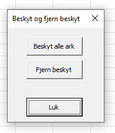
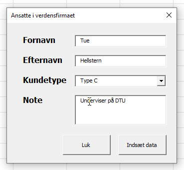

[HOME](../README.md)

# VBA online - 07-04-2022

# Forms
I VBA er det også muligt at oprette Forms. Der gør det nemmere for brugeren at afvikle et VBA program, men det gør det også nemmere for dig som udvikler at styrer program afviklingen og evt. data input.

[Microsoft Info](https://support.microsoft.com/da-dk/office/oversigt-over-formularer-kontrolelementer-i-formularer-activex-kontrolelementer-i-et-regneark-15ba7e28-8d7f-42ab-9470-ffb9ab94e7c2)

## Simpel Beskyt form
Den første form vi opretter er en simpel form der gør det nemt for brugeren at beskytte alle ark og fjerne denne beskyttelse igen.



### Kode
Her er koden til formen

```vb
Option Explicit

Private Sub cmdBeskyt_Click()
    Dim ws As Worksheet
    
    For Each ws In ActiveWorkbook.Worksheets
        ws.Protect
    Next ws
    
    ' Luk formen
    frmBeskyt.Hide
    
End Sub

Private Sub cmdFjernBeskyt_Click()
    Dim ws As Worksheet
    
    For Each ws In ActiveWorkbook.Worksheets
        ws.Unprotect
    Next ws
End Sub

Private Sub cmdLuk_Click()
    frmBeskyt.Hide
End Sub
```

Koden til at vise formen, skal være i et **module**:

```vb
Sub VisBeskytForm()
    frmBeskyt.Show
End Sub
```

### Video
<div style="position: relative; padding-bottom: 105.21920668058455%; height: 0;"><iframe src="https://www.loom.com/embed/38229d9d5c8c41438bfcfa73ae81801b" frameborder="0" webkitallowfullscreen mozallowfullscreen allowfullscreen style="position: absolute; top: 0; left: 0; width: 100%; height: 100%;"></iframe></div>

## Ansatte form
Formular der gør det muligt indsætte følgende informationer om ansatte via en Form:

- Fornavn
- Efternavn
- Kundetype
- Note



### Video

### Kode

```vb
Option Explicit

Private Sub cmdDataInd_Click()
    ' Variable
    Dim AntalRow As Double

    ' Find antal Rows med data
    If Range("A2").Value <> "" Then
        AntalRow = (Range("A1", Range("A1").End(xlDown)).Rows.Count) + 1
    Else
        AntalRow = 2 ' Kun når Cellen A2 er tom
    End If
    
    ' Indsæt data
    Range("A" & AntalRow).Value = txtFornavn.Text
    Range("B" & AntalRow).Value = txtEfternavn.Text
    Range("C" & AntalRow).Value = cboKundeType.Text
    Range("D" & AntalRow).Value = txtNote.Text
End Sub

Private Sub cmdLuk_Click()
    ' Luk formen
    Unload Me
End Sub

Private Sub UserForm_Activate()

    Dim i As Integer
    Dim AntalRow As Integer
    
    ' Vælger kundetype arket
    Kundetype.Select
    
    ' Find antal Rows med data
    AntalRow = (Range("A1", Range("A1").End(xlDown)).Rows.Count) + 1
    
    For i = 1 To AntalRow
        cboKundeType.AddItem Range("A" & i + 1).Text
    Next
    
    ' Vælger navne ark
    Navne.Select
    
End Sub
```

# PowerPoint

## Video

## Kode
Her er koden til at overføre diagrammer til PowerPoint

```vb
Sub Overfor_til_PowerPoint()
    ' Variabler
    Dim pptApp As PowerPoint.Application
    Dim pptPres As PowerPoint.Presentation
    Dim pptSlide As PowerPoint.Slide
    
    Dim pptSlideCount As Integer ' Antal Slides
    Dim cht As Excel.ChartObject ' Excel diagram
    
    ' Vælg ark
    PowerPointArk.Select
    
    ' Åben PowerPoint
    Set pptApp = New PowerPoint.Application ' Åben applikationen PowerPoint
    Set pptPres = pptApp.Presentations.Add  ' Tilføj en præsentation
    
    
    ' Find alle Diagrammer i det aktive sheet
    For Each cht In ActiveSheet.ChartObjects
    
        ' Slide
        pptSlideCount = pptPres.Slides.Count ' Antal slide i præsentationen
        Set pptSlide = pptPres.Slides.Add(pptSlideCount + 1, ppLayoutBlank) ' Blankt slide
    
        ' Diagram
        cht.Select ' Vælg diagram
        ActiveChart.ChartArea.Copy ' Kopi af slide
        pptSlide.Shapes.PasteSpecial (ppPasteJPG) ' Indsæt slide i PowerPoint
        
        ' Tilpasning af diagram
        With pptApp.ActiveWindow.Selection.ShapeRange
            .Height = Application.CentimetersToPoints(12)
            .Width = Application.CentimetersToPoints(20)
            .Left = Application.CentimetersToPoints(7)
            .Top = Application.CentimetersToPoints(3)
        End With
    
    Next
    
    ' Luk / Gem
    pptPres.SaveAs Application.ActiveWorkbook.Path & "\test.pptx"
    
    pptPres.Close
    pptApp.Quit
    
End Sub
```