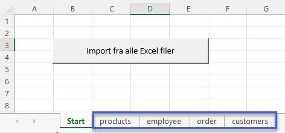

[HOME](../README.md)

# VBA online - 07-04-2022

- [Excel Forms](#forms)
- [Import Ark](#import-ark)
- [VBA PowerPoint](#powerpoint)


# Forms
I VBA er det også muligt at oprette Forms. Der gør det nemmere for brugeren at afvikle et VBA program, men det gør det også nemmere for dig som udvikler at styrer program afviklingen og evt. data input.

[Microsoft Info](https://support.microsoft.com/da-dk/office/oversigt-over-formularer-kontrolelementer-i-formularer-activex-kontrolelementer-i-et-regneark-15ba7e28-8d7f-42ab-9470-ffb9ab94e7c2)

## Simpel Beskyt form
Den første form vi opretter er en simpel form der gør det nemt for brugeren at beskytte alle ark og fjerne denne beskyttelse igen.


### Kode
Her er koden til formen

```vb
Option Explicit

Private Sub cmdBeskyt_Click()
    Dim ws As Worksheet
    
    For Each ws In ActiveWorkbook.Worksheets
        ws.Protect
    Next ws
    
    ' Luk formen
    frmBeskyt.Hide
    
End Sub

Private Sub cmdFjernBeskyt_Click()
    Dim ws As Worksheet
    
    For Each ws In ActiveWorkbook.Worksheets
        ws.Unprotect
    Next ws
End Sub

Private Sub cmdLuk_Click()
    frmBeskyt.Hide
End Sub
```

Koden til at vise formen, skal være i et **module**:

```vb
Sub VisBeskytForm()
    frmBeskyt.Show
End Sub
```

### Video
<div style="position: relative; padding-bottom: 105.21920668058455%; height: 0;"><iframe src="https://www.loom.com/embed/38229d9d5c8c41438bfcfa73ae81801b" frameborder="0" webkitallowfullscreen mozallowfullscreen allowfullscreen style="position: absolute; top: 0; left: 0; width: 100%; height: 100%;"></iframe></div>

## Ansatte form
Formular der gør det muligt indsætte følgende informationer om ansatte via en Form:

- Fornavn
- Efternavn
- Kundetype
- Note


### Video
<div style="position: relative; padding-bottom: 105.21920668058455%; height: 0;"><iframe src="https://www.loom.com/embed/d3db0446bf8144969c10c4f8a77b0c3e" frameborder="0" webkitallowfullscreen mozallowfullscreen allowfullscreen style="position: absolute; top: 0; left: 0; width: 100%; height: 100%;"></iframe></div>

### Kode

```vb
Option Explicit

Private Sub cmdDataInd_Click()
    Dim AntalRow As Double
    
    ' Find første tomme celle
    If Range("A2").Value <> "" Then
        AntalRow = (Range("A1", Range("A1").End(xlDown)).Rows.Count) + 1
    Else
        AntalRow = 2
    End If
    
    ' Indsæt data
    Range("A" & AntalRow).Value = txtFornavn.Text
    Range("B" & AntalRow).Value = txtEfternavn.Text
    Range("C" & AntalRow).Value = cmdKundetype.Text
    Range("D" & AntalRow).Value = txtNote.Text
End Sub

Private Sub cmdLuk_Click()
    frmAnsatte.Hide
End Sub


Private Sub UserForm_Activate()
    ' Variable
    Dim i As Integer
    
    ' Data i dropdown
    For i = 1 To 3
        cmdKundetype.AddItem ("A" & i)
    Next
End Sub
```

# Import Ark
En typisk VBA opgave kunne være at import af alle ark fra de Excel filer der ligger i en bestem mappe, til en samlet Excel fil.



## Filer
Der er 4 Excel filer hvorfra vi gerne vil importere alle ark til en samlet Excel fil:

- [data_1.xlsx](./filer/data_1.xlsx)
- [data_2.xlsx](./filer/data_2.xlsx)
- [data_3.xlsx](./filer/data_3.xlsx)
- [data_4.xlsx](./filer/data_4.xlsx)

Du skal hente disse 4 filer for at kunne afvikle koden.

I denne kode er de placeret i mappen **C:\test** - *Det kan du ændre efter behov*.

Du kan hente min Excel filer her: [import-sheets.xlsm](./filer/import-sheets.xlsm)

## Video
<div style="position: relative; padding-bottom: 105.21920668058455%; height: 0;"><iframe src="https://www.loom.com/embed/9b51bc821a2c45d0b6be28bdca1bc15b" frameborder="0" webkitallowfullscreen mozallowfullscreen allowfullscreen style="position: absolute; top: 0; left: 0; width: 100%; height: 100%;"></iframe></div>

## Kode
Her kode til import af ark.

```vb
Sub ImportArkAlleExcelFiler()

    ' Variable
    Dim directory As String
    Dim fileName As String
    Dim sheet As Worksheet
    Dim total As Integer
    Dim myactiveworkbook As String

    ' Hastigheds optimering - Til
    With Application
        .ScreenUpdating = False
        .DisplayAlerts = False
    End With
    
    ' Aktive workbook name
    myactiveworkbook = activeworkbook.Name

    ' Mappe og filtype
    ' Indsæt navnet på den mappe hvor Excel filerne ligger
    directory = "c:\test\"
    fileName = Dir(directory & "*.xls?") ' Alle Excel filer

    ' Gennemløb af alle Excel filer i mappen c:\test\
    Do While fileName <> ""
    
        ' Åben Excel(erne) filen
        Workbooks.Open (directory & fileName)
        
        For Each sheet In Workbooks(fileName).Worksheets
            total = activeworkbook.Worksheets.Count
            Workbooks(fileName).Worksheets(sheet.Name).Copy _
                after:=Workbooks(myactiveworkbook).Worksheets(total)
        Next sheet
        
        ' Luk Excel filen
        Workbooks(fileName).Close
    
        ' Næste Excel fil
        fileName = Dir()
    
    Loop

    ' Gå til Start arket
    Start.Activate

    ' Hastigheds optimering - Fra
    With Application
        .ScreenUpdating = True
        .DisplayAlerts = True
    End With
    
End Sub
```

# PowerPoint
Når du har oprette diagrammer i Excel er det tit fordi de skal bruges i en PowerPoint præsentation. Hvis det er noget du til opdatere og så skal oprette en ny PowerPoint kunne det være en fordel med en makro.

Denne makro tager alle diagrammer fra arket PowerPoint med VBA navnet PowerPointArk og kopier dem over i en ny PowerPoint præsentation.


## References - PowerPoint
Når du skal have adgang til VBA i et andet Office program - i dette tilfælde PowerPoint - skal du oprette en Reference til dette programs objeckt model.

Dette gøres på følgende måde:

- I VBA - klik på **Tools**
- Vælg **References**
- Find **Microsoft PowerPoint XX Object Library** - *I dette tilfælde er det nummer 15.0, men det vil ændre sig med versionen af Office.*
- Klik **Ok**


Hvis denne reference ikke er på plads vil kode ikke virke, da det ikke er muligt at bruge PowerPoint VBA.

## Video
<div style="position: relative; padding-bottom: 105.21920668058455%; height: 0;"><iframe src="https://www.loom.com/embed/352ea7958e8842b9a68f0e69c9745b64" frameborder="0" webkitallowfullscreen mozallowfullscreen allowfullscreen style="position: absolute; top: 0; left: 0; width: 100%; height: 100%;"></iframe></div>

## Kode
Her er koden til at overføre diagrammer til PowerPoint

```vb
Sub Overfor_til_PowerPoint()
    ' Variabler
    Dim pptApp As PowerPoint.Application
    Dim pptPres As PowerPoint.Presentation
    Dim pptSlide As PowerPoint.Slide
    
    Dim pptSlideCount As Integer ' Antal Slides
    Dim cht As Excel.ChartObject ' Excel diagram
    
    ' Vælg ark
    PowerPointArk.Select
    
    ' Åben PowerPoint
    Set pptApp = New PowerPoint.Application ' Åben applikationen PowerPoint
    Set pptPres = pptApp.Presentations.Add  ' Tilføj en præsentation
    
    
    ' Find alle Diagrammer i det aktive sheet
    For Each cht In ActiveSheet.ChartObjects
    
        ' Slide
        pptSlideCount = pptPres.Slides.Count ' Antal slide i præsentationen
        Set pptSlide = pptPres.Slides.Add(pptSlideCount + 1, ppLayoutBlank) ' Blankt slide
    
        ' Diagram
        cht.Select ' Vælg diagram
        ActiveChart.ChartArea.Copy ' Kopi af slide
        pptSlide.Shapes.PasteSpecial (ppPasteJPG) ' Indsæt slide i PowerPoint
        
        ' Tilpasning af diagram
        With pptApp.ActiveWindow.Selection.ShapeRange
            .Height = Application.CentimetersToPoints(12)
            .Width = Application.CentimetersToPoints(20)
            .Left = Application.CentimetersToPoints(7)
            .Top = Application.CentimetersToPoints(3)
        End With
    
    Next
    
    ' Luk / Gem
    pptPres.SaveAs Application.ActiveWorkbook.Path & "\salgsdiagrammer.pptx"
    
    pptPres.Close
    pptApp.Quit
    
End Sub
```