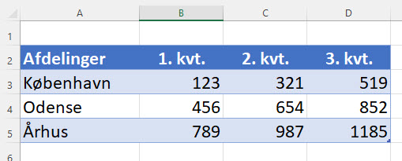

[HOME](../README.md)
# Online - 24-03-2022

# Emner
- [Excel til 24-03-2022](#excel-fil)
- [Word](#word)

# Excel fil
Jeg har oprette en Excel som indeholder en Tabel med data som jeg brugere - Den Excel fil kan du hente her . Den indeholder ikke noget VBA kode.

Min Excel fil, der indeholder den færdige VBA kode, kan hentes her 

Jeg vil dog anbefale at i selv skriver VBA koden og får det til at virke - **Det vil sige brug kun min fil hvis i kører helt fast :-)**

# Word
Vi har en Tabel i Excel der skal overføres til Word, da det er noget vi skal gøre hver gang data i Excel bliver opdateret vil vi gerne gøre det via en makro.

Denne tabel skal over i et Word dokument, **DataImport.dotx**, dette Word dokument indeholder lidt tekst og 2 "Bogmærke" (*Bookmark*)

- bmkDato
- bmkDataTabel

Jeg forudsætter at Excel filen og Word dokumentet er i den sammen mappe.

