# Funktioner - User Define Functions
Excel har over 450 indbyggede funktioner, men du kan også oprette dine egne Excel funktioner - **User Define Functions** også kaldet **UDF**.

Selvom Excel er rigtig godt dækket ind med over 450 funktioner, er der noget tilfælde hvor det giver mening at oprette en UDF.

- Der findes ikke en Excel funktion
- Du har en complex formel/beregning som du gerne vil dele med andre
- Du vil eller kan ikke bruge makro

## Opret din første UDF
Dine UDF funktioner skal oprettes i *Visual Basic Editoren*, som du nemmest kan aktivere på disse to måder:

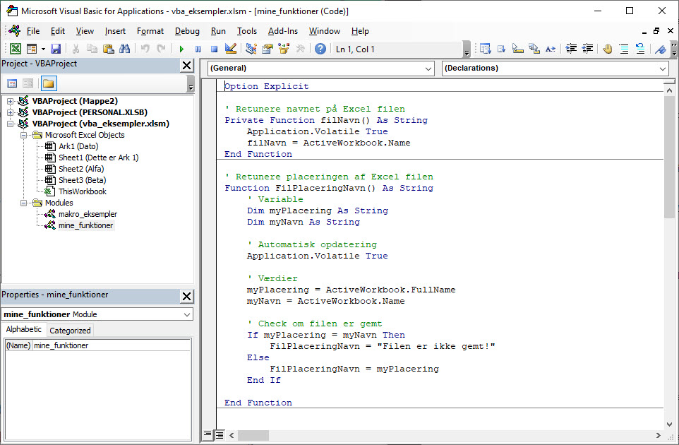

### Tastatur Genvej
Nemmest og hurtigst kan du åbne *Visual Basic Editoren* med genvejen: **ALT + F11**

### Udvikler fanen
Der er en fane som er rigtig nyttig når du arbejder med VBA kode og det er **Udvikler** fanen. Den er ikke aktiveres som default men kan nemt aktiveres

*Filer ➜ Indstillinger ➜ Tilpas båndet ➜ Sæt hak ud for* **Udvikler** ➜ Klik Ok

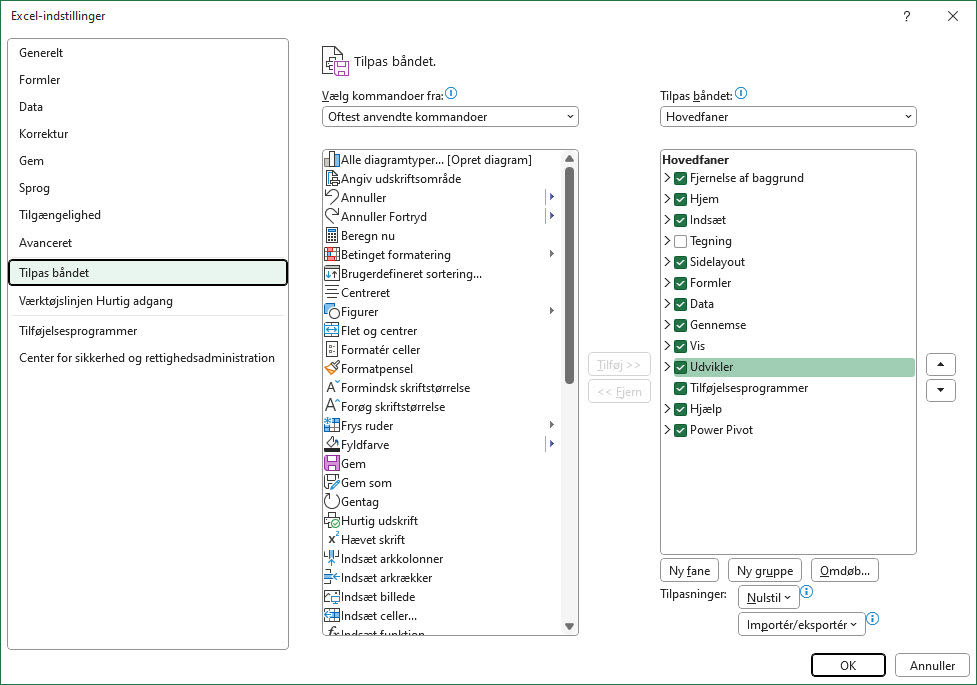

Når du har aktiveret Udvikler fanen kan du klikke på knappen Visual Basic og du åbner *Visual Basic Editoren*

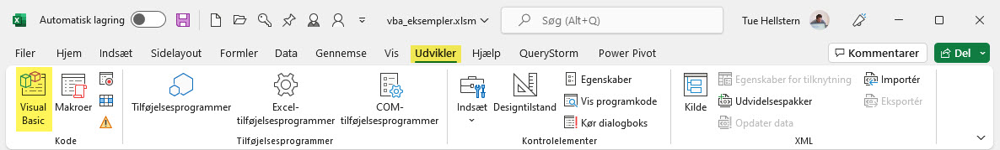

### Indsæt Module
Når du har åbnet *Visual Basic Editoren* skal du indsætte et Module hvor dine UDF'er skal oprettes.

- Klik på Insert ➜ Module

Du har nu indsat et nyt tomt Module, du kan med fordel give modulet et navn der er mere sigende end *Module1*, f.eks. **myUDF**

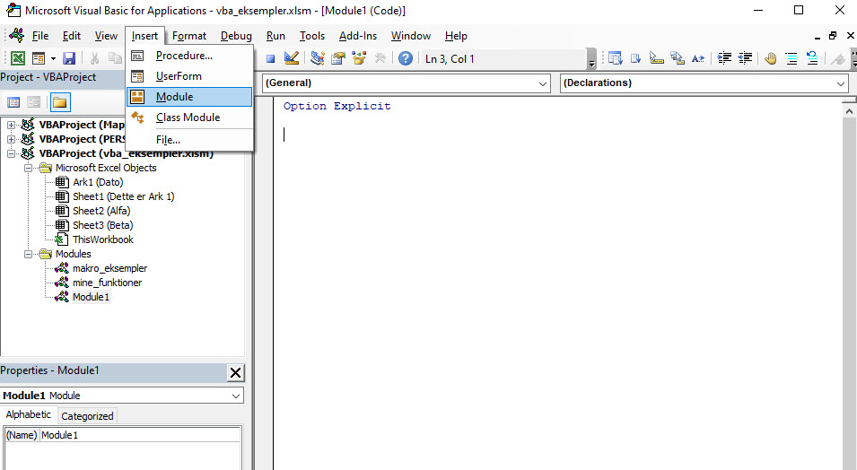

Du er nu klar til at oprette din første UDF, prøv med denne *simple* kode

```basic
Function FilNavn() As String
    FilNavn = ThisWorkbook.Name
End Function
```

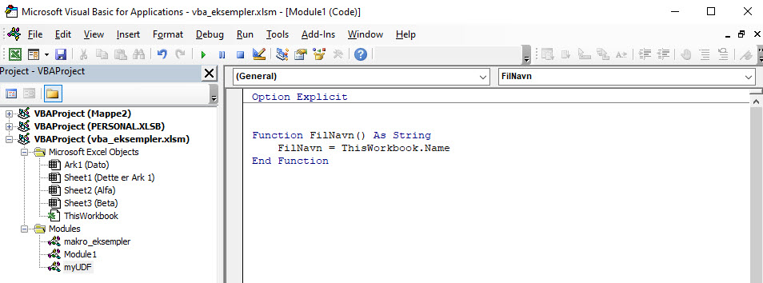

### Brug af UDF
Du brugere dine egne funktioner på sammen måde som de indbyggede Excel funktioner i den Excel fil hvor du har oprettet dem.

Her er det den UDF du lige har oprettet, **FilNavn**, der er brugt

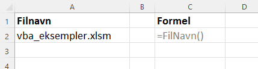


# Eksempler på UDF
Som inspiration har jeg oprettet nogle eksempler på nyttige UDF'er, som du kan starte med.

## Returnere navnet på Excel filen
Denne UDF returnere navnet på Excel filen. Det er en funktion der ikke modtager nogle argumenter, ligesom f.eks. **=IDAG()** eller **=SLUMP()**

```basic
Function FilNavn() As String
    FilNavn = ThisWorkbook.Name
End Function
```

**Note:** *Denne funktion har et problem. Hvis du ændre filnavnet, opdateres det **ikke** automatisk!*

Normalt opdateres en funktion, når der er en ændring i input-argumenterne. Men da der ikke er nogen argumenter i denne funktion, genberegnes funktionen ikke, selvom du ændrer navnet på filen, lukker den og åbner den igen. Du kan gennemtvinge en genberegning ved at bruge tastaturgenvejen - **Control + Alt + F9**

For at få funktionen til at genberegne automatisk, når der er en ændring i regnearket, skal den udvides med en ekstra kodelinje: **Application.Volatile True**

```basic
Function FilNavn() As String
    Application.Volatile True
    FilNavn = ThisWorkbook.Name
End Function
```

## Filplacering og navn
Hvis du gerne vil indsætte navn og placering på Excel filen kan du bruge denne UDF. Den har desuden et check om filen faktisk er gemt.

```basic
Function FilPlaceringNavn() As String
    ' Variable
    Dim myPlacering As String
    Dim myNavn As String
    
    ' Værdier
    myPlacering = ActiveWorkbook.FullName
    myNavn = ActiveWorkbook.Name
    
    ' Check om filen er gemt
    If myPlacering = myNavn Then
        FilPlaceringNavn = "Filen er ikke gemt!"
    Else
        FilPlaceringNavn = myPlacering
    End If
End Function
```

## Vis kun tal fra en celle
Med denne funktion kan du udtrække alle tal fra en celle der indeholder både tekst og tal.

```basic
Function FindTal(CellRef As String)
    ' Variable
    Dim TekstLen As Integer
    Dim i As Integer
    Dim Tal As Double
    
    ' Find længden af teksten
    TekstLen = Len(CellRef)
    
    ' Gennemløb af teksten
    For i = 1 To TekstLen
        If IsNumeric(Mid(CellRef, i, 1)) Then
            Tal = Tal & Mid(CellRef, i, 1)
        End If
    Next i
    
    ' Retuner
    FindTal = Tal
End Function
```

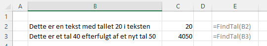

## Forskudt regnskabsår
Når årsregnskabet ikke følger kalenderåret kaldes det for et forskudt regnskabsår. Der er ingen regler for hvornår skæringsdatoen ligger på regnskabsåret. Mange virksomheder vælger for eksempel at føre regnskabsår fra 1/7-30/6.

Det giver et problem når du skal finde ud af hvilket regnskabs år en given data tilhører.

Denne UDF løser dette problem, den har to input **checkDato** og optional start **StartMaanede**.

Hvis der ikke angives en **StartMaanede** vil regnskabsåret følge kalender året. 

```basic
Function RegnskabsAar(checkDato As Date, Optional StartMaanede As Byte) As Long
    
    ' Hvis StartMaanede IKKE er udfyldt
    If StartMaanede = 0 Then
        StartMaanede = 13
    End If
    
    ' Find regnskabsår
    RegnskabsAar = IIf(Month(checkDato) >= StartMaanede, 1, 0) + Year(checkDato)
    
End Function
```

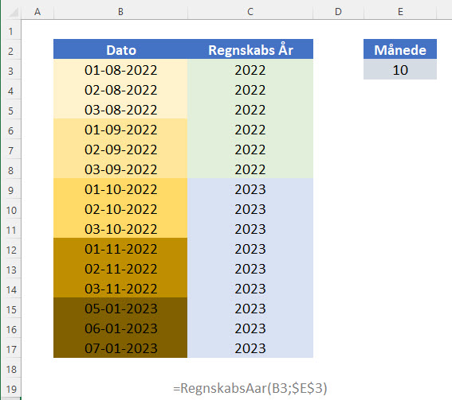

# Excel add-in
Det er nemt at bruge dine UDF'er **i den Excel fil hvor de er oprettet**, når du vil bruge dem i andre Excel filer bliver det hurtigt lidt *besværligt*.

Det du skal gøre er at gemme din Excel fil, med dine UDF'er i, som et **Excel Tilføjelsesprogram** (*add-in*).

Hvilket også gør det nemt at dele dine UDF'er med andre.

## Opret add-in
Du opretter en **Excel add-in** på følgende måde

- Gem filen hvor dine UDF'er er i som Excel-tilføjelsesprogrammer (.xalm)
    - *Filer ➜ Gem som ➜ Excel-tilføjelsesprogrammer (.xalm)*
    - Som standard vil Excel gemme filen i mappen *c: > Users > navn > AppData > Roaming > AddIns*
- Genstart Excel

Alle de **Excel-tilføjelsesprogrammer (.xalm)** der ligger i standard mappen bliver automatisk "*installeret*" og du har nu mulighed for at aktivere dem.

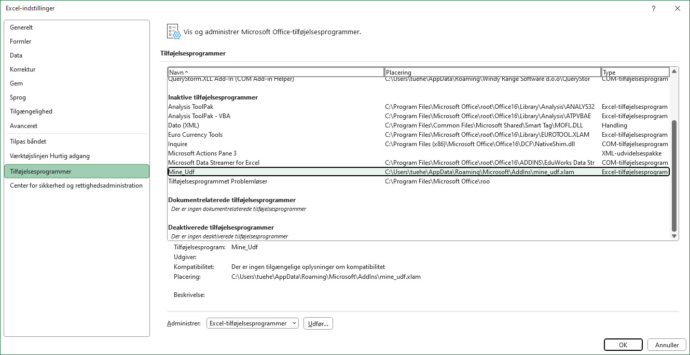

## Aktiver add-in
For at bruge dit add-in skal det aktiveres, hvilket du gør på følgende måde:

- Åben Excel indstillinger
    - Filer ➜ Indstillinger ➜ Tilføjelseprogrammer ➜ Udfør

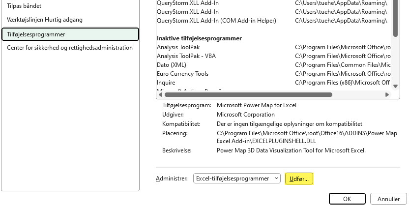

Nu er det muligt at vælge dit Tilføjelseprogramme (*add-in*), i dette tilfælde **Mine_Udf**

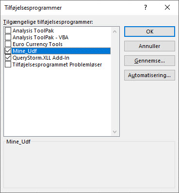

Du kan nu bruge dine UDF'er i alle Excel filer du åbner.

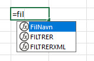


# Scope af en funktion
En funktion kan enten være **Public** eller **Private**.

Om funktionen er det en eller det andet har betydning for hvor du kan kalde den fra - *Bruge den*.

## Public
Når du opretter en funktion er den som default Public, også uden du angiver dette.

Det at en function er **Public** betyder at du kan bruge den fra den Excel fil du har åben og andre Excel filer. Du kan se den under *Brugerdefinerede funktioner* i Excel.

Det vil sige at disse to funktioner begge er **Public**:

**Public by default**
```basic
Function filNavn() As String
    Application.Volatile True
    filNavn = ActiveWorkbook.Name
End Function
```

**Angivet som Public**
```basic
Public Function filNavn() As String
    Application.Volatile True
    filNavn = ActiveWorkbook.Name
End Function
```

## Private
En Private funktion kan kun kaldes fra det modul hvor den er oprettet, du kan **ikke** se den under *Brugerdefinerede funktioner* i Excel.

Hvis du f.eks. har en **Private** funktion i *Modul1* kan den kun kaldes fra *Modul1*

```basic
Private Function filNavn() As String
    Application.Volatile True
    filNavn = ActiveWorkbook.Name
End Function
```

**Note**: *Det er dog muligt at bruge en Private funktion i Excel ved at skrive navnet på funktionen, selvom den er Private!*
